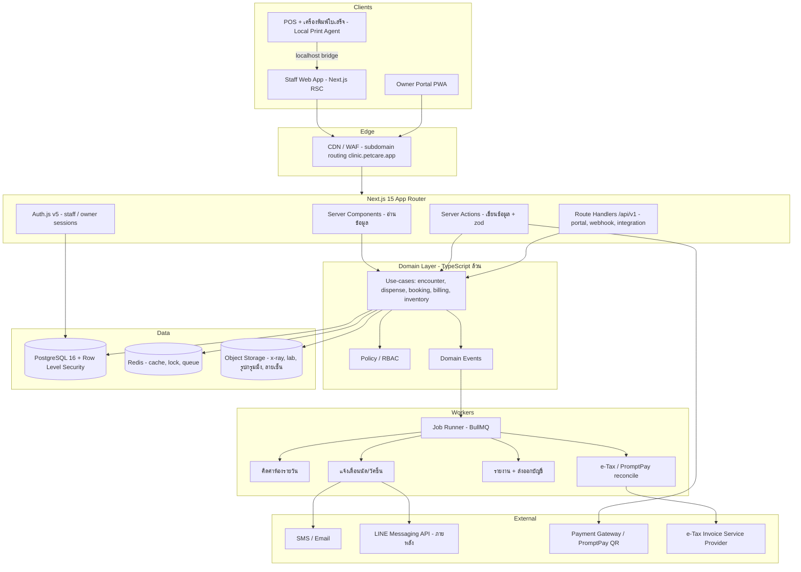
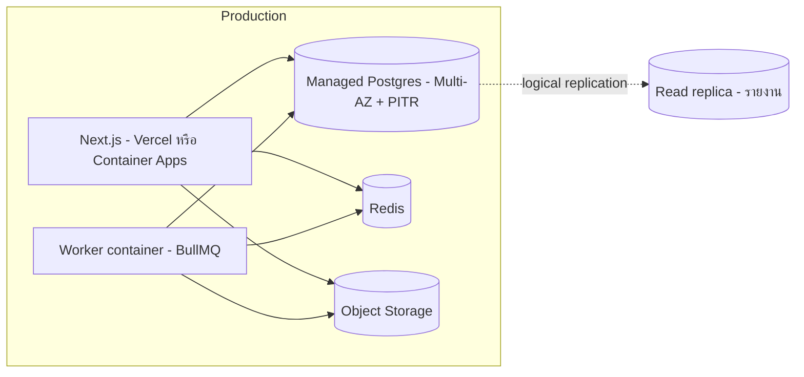

# 01 — สถาปัตยกรรมระบบ

## 1. ภาพรวม



## 2. เหตุผลของการเลือกสถาปัตยกรรม

**Modular monolith ไม่ใช่ microservices** — ปริมาณธุรกรรมของคลินิกไม่ได้สูง แต่ความสัมพันธ์
ระหว่างโดเมนแน่นมาก (จ่ายยา = ตัดสต็อก + ลงเวชระเบียน + ตั้งค่าใช้จ่าย ในทรานแซกชันเดียว)
การแตกเป็นเซอร์วิสตั้งแต่แรกจะได้ distributed transaction มาแลกกับประโยชน์ที่ยังไม่มี
จึงแยกเป็นโมดูลที่มีขอบเขตชัดในโค้ดเบสเดียว แล้วค่อยแตกทีหลังถ้าจำเป็น

**Server Actions สำหรับแอปพนักงาน, REST สำหรับส่วนที่เหลือ** — แอปพนักงานได้ประโยชน์จาก
RSC (โหลดเร็ว ไม่ต้องเขียน API ซ้ำซ้อน) ส่วนพอร์ทัลลูกค้า / เว็บฮุก / การเชื่อมต่อภายนอก
ใช้ `/api/v1` ที่มี OpenAPI spec ชัดเจน เพราะจะมีแอปมือถือและระบบอื่นมาต่อในอนาคต

**Domain layer แยกจาก Next.js** — use-case ทั้งหมดเป็นฟังก์ชัน TypeScript ธรรมดาที่รับ
`ctx` (tenant, branch, actor, tx) ทำให้เทสได้โดยไม่ต้องยก HTTP และย้าย framework ได้

## 3. Multi-tenancy

### 3.1 รูปแบบที่เลือก — Shared database + Shared schema + Row Level Security

| ทางเลือก | ข้อดี | ข้อเสีย | ตัดสิน |
| --- | --- | --- | --- |
| DB ต่อ tenant | แยกขาด กู้คืนรายลูกค้าง่าย | migrate ลำบากมากเมื่อมี 200+ คลินิก ต้นทุนสูง | ✗ เก็บไว้เป็น option ระดับ Enterprise |
| Schema ต่อ tenant | แยกดี ยัง migrate เป็นชุดได้ | connection pool บวม จำนวน schema เยอะทำให้ catalog ช้า | ✗ |
| **Shared + RLS** | ต้นทุนต่ำ migrate ครั้งเดียว รายงานข้าม tenant ทำได้ | พลาดแล้วข้อมูลรั่ว จึงต้องบังคับที่ชั้น DB | ✓ |

### 3.2 การบังคับใช้

ทุกตารางที่เป็นข้อมูลของคลินิกมีคอลัมน์ `tenant_id` และเปิด RLS:

```sql
ALTER TABLE "Pet" ENABLE ROW LEVEL SECURITY;
ALTER TABLE "Pet" FORCE ROW LEVEL SECURITY;

CREATE POLICY tenant_isolation ON "Pet"
  USING (tenant_id = current_setting('app.tenant_id', true)::uuid)
  WITH CHECK (tenant_id = current_setting('app.tenant_id', true)::uuid);
```

แอปเชื่อมต่อด้วย role `app_user` ที่ **ไม่ใช่** owner ของตาราง (ถ้าเป็น owner จะข้าม RLS)
ส่วน migration ใช้ role `app_migrator` แยกต่างหาก

Prisma ตั้งค่า tenant ผ่าน client extension ที่ห่อทุกคำสั่งไว้ในทรานแซกชัน:

```ts
// src/server/db/tenant-client.ts
export function forTenant(tenantId: string) {
  return prisma.$extends({
    query: {
      $allModels: {
        async $allOperations({ args, query }) {
          return prisma.$transaction(async (tx) => {
            await tx.$executeRaw`SELECT set_config('app.tenant_id', ${tenantId}, true)`;
            return query(args);
          });
        },
      },
    },
  });
}
```

> `set_config(..., true)` คือ local ต่อทรานแซกชัน จึงปลอดภัยกับ connection pool
> งานที่มีหลายคำสั่งให้เปิดทรานแซกชันเองแล้วเรียก `set_config` ครั้งเดียวที่ต้นเรื่อง

### 3.3 การแยกสาขา (Branch)

`branch_id` **ไม่ใช้ RLS** แต่บังคับที่ชั้น policy ของแอป เพราะผู้ใช้บางคน (ผู้จัดการ/เจ้าของ)
ต้องเห็นข้ามสาขาโดยตั้งใจ

- ผูกกับสาขาเสมอ: สต็อก, กรง, ทรัพยากร/ตารางเวลา, เลขที่เอกสารภาษี, กะเงินสด
- ใช้ร่วมทั้ง tenant: เจ้าของ, สัตว์, เวชระเบียน, แค็ตตาล็อกสินค้า/บริการ

### 3.4 การกำหนด tenant จาก request

1. Subdomain `clinicA.petcare.app` → middleware map เป็น `tenantId` (cache ใน Redis)
2. ตรวจ session ว่าผู้ใช้มี `Membership` ใน tenant นั้นและ `status = ACTIVE`
3. ใส่ `tenantId`, `branchId`, `actor`, `permissions` ลง request context

## 4. โครงสร้างโค้ด

```
src/
├─ app/
│  ├─ (staff)/[branch]/          # แอปพนักงาน
│  │   ├─ reception/             # คิว, เช็คอิน, whiteboard
│  │   ├─ patients/              # เจ้าของ + สัตว์
│  │   ├─ encounters/[id]/       # หน้าจอตรวจรักษา
│  │   ├─ schedule/              # ปฏิทินนัด/ทรัพยากร
│  │   ├─ boarding/              # ผังกรง, เช็คอิน-เอาท์
│  │   ├─ grooming/              # คิวช่าง
│  │   ├─ inventory/             # สต็อก, PO, ตรวจนับ
│  │   ├─ pos/                   # ขายหน้าร้าน
│  │   ├─ billing/               # บิล, ใบกำกับภาษี, ปิดกะ
│  │   ├─ reports/
│  │   └─ settings/              # คอนโซลผู้ดูแลของคลินิก (docs/12)
│  ├─ (portal)/                  # พอร์ทัลเจ้าของสัตว์
│  ├─ (platform)/admin/          # แอดมิน SaaS (docs/12)
│  └─ api/v1/...                 # REST + webhooks
├─ modules/                      # โดเมน (ห้าม import จาก next/*)
│  ├─ identity/  crm/  patient/  scheduling/  clinical/
│  ├─ pharmacy/  inventory/  boarding/  grooming/
│  ├─ billing/   tax/   notification/  reporting/
│  └─ shared/                    # money, ids, result, errors, events
├─ server/
│  ├─ db/        # prisma client, tenant extension, RLS helper
│  ├─ auth/      # Auth.js config, สอง provider: staff / owner
│  ├─ policy/    # RBAC, ability builder
│  ├─ jobs/      # BullMQ queues + workers
│  └─ context.ts
├─ components/   # UI (shadcn/ui + Tailwind)
└─ lib/          # i18n, date (พ.ศ.), format, validation
```

**กติกาการ import:** `app/` เรียก `modules/` ได้; `modules/` เรียกข้ามโดเมนได้เฉพาะผ่าน
public API ของโมดูล (`modules/x/index.ts`) และห้าม `modules/` import อะไรจาก `app/`
บังคับด้วย ESLint `import/no-restricted-paths`

### 4.1 ผังเส้นทางทั้งระบบ (sitemap)

ผังนี้คือ**เป้าหมายของการออกแบบ** ส่วนสถานะว่าทำถึงไหนแล้วอยู่ใน [docs/STATUS.md](STATUS.md)

```
สาธารณะ
/                                     หน้าแรก — ทางเข้า 2 ทาง (พนักงาน/เจ้าของสัตว์); ถ้ามีเซสชันแล้วพาไปหน้าของบทบาทนั้น
/login                                พนักงาน — อีเมล + รหัสผ่าน (+ TOTP)
/portal/login                         เจ้าของสัตว์ — เบอร์โทร + OTP

แอปพนักงาน — (staff)/[branch]/…       branch = รหัสสาขา เช่น /bkk
/[branch]                             แดชบอร์ดวันนี้
/[branch]/reception                   รับสัตว์ walk-in → เปิด Encounter
/[branch]/queue                       กระดานคิวและสถานะห้องตรวจ
/[branch]/appointments                ปฏิทินนัดและทรัพยากร
/[branch]/clients                     ทะเบียนเจ้าของ (ค้นหาช่องเดียว)
/[branch]/clients/[ownerId]           โปรไฟล์เจ้าของ + สัตว์ในบ้าน
/[branch]/pets/[petId]                แฟ้มสัตว์ ประวัติ น้ำหนัก วัคซีน
/[branch]/encounters/[id]             ห้องตรวจ — SOAP, vital, สั่งยา/แล็บ
/[branch]/pharmacy                    ห้องยา — จ่ายยา FEFO
/[branch]/inventory                   คลัง — สต็อก รับเข้า ตรวจนับ
/[branch]/inventory/controlled        ทะเบียนยาควบคุม (docs/05 §6.1)
/[branch]/pos                         ขายหน้าร้าน + รวมบิล
/[branch]/billing                     ใบกำกับ ใบลดหนี้ ปิดกะเงินสด (docs/06)
/[branch]/boarding                    ผังกรง เช็คอิน-เอาท์ (docs/04)
/[branch]/grooming                    คิวช่างและงานอาบน้ำตัดขน (docs/04)
/[branch]/reports                     รายงานสาขา/ผู้บริหาร (docs/06, docs/10)
/[branch]/settings/…                  คอนโซลผู้ดูแล (docs/12) — ดูตารางด้านล่าง

พอร์ทัลเจ้าของสัตว์ — /portal (docs/07)
/portal                               หน้าแรก: สัตว์ของฉัน นัดที่จะถึง ฝากเลี้ยง ใบเสร็จ
/portal/pets/[petId]                  ประวัติสัตว์ วัคซีน ยาที่ได้รับ
/portal/booking                       จองคิวตรวจ/กรูมมิ่ง/ห้องฝาก
/portal/stays/[stayId]                ติดตามสัตว์ที่ฝากอยู่ + CareLog ที่แชร์
/portal/invoices                      ใบเสร็จย้อนหลัง
/portal/profile                       ข้อมูลติดต่อและคำยินยอม PDPA

แพลตฟอร์ม SaaS — (platform)/admin (docs/12 §4 PLT-*)
/admin                                ภาพรวมระบบ
/admin/tenants  /admin/tenants/[id]   ทะเบียนคลินิก (PLT-01)
/admin/plans                          แพ็กเกจและการสมัครใช้งาน (PLT-02)
/admin/flags                          feature flag (PLT-03)
/admin/onboarding                     wizard เปิดคลินิกใหม่ (PLT-04)
/admin/usage                          การใช้งานและสุขภาพระบบ (PLT-05)

API
/api/auth/[...nextauth]               Auth.js (พนักงาน)
/api/auth/otp                         ขอ/ยืนยัน OTP เจ้าของสัตว์
/api/v1/health                        health check
/api/v1/…                             REST ตามสัญญาใน docs/09
/api/v1/webhooks/…                    webhook ขาเข้า (docs/09 §4.9)
```

**เส้นทางในคอนโซลผู้ดูแล** — รหัส ADM อ้างถึง [docs/12 §3](12-admin-console.md)

| เส้นทาง | หน้าจอ | เส้นทาง | หน้าจอ |
| --- | --- | --- | --- |
| `settings/users` | ADM-01 | `settings/resources` | ADM-09 |
| `settings/roles` | ADM-02 | `settings/shifts` | ADM-10 |
| `settings/branches` | ADM-03 | `settings/policies` | ADM-11 |
| `settings/tax` | ADM-04 | `settings/notifications` | ADM-12 |
| `settings/tax/sequences` | ADM-05 | `settings/reference` | ADM-13 |
| `settings/catalog/services` | ADM-06 | `settings/suppliers` | ADM-14 |
| `settings/catalog/products` | ADM-07 | `settings/import` | ADM-15 |
| `settings/catalog/tax-review` | ADM-08 | `settings/audit` · `settings/pdpa` | ADM-16 · ADM-17 |
| `settings/translations` | ADM-18 (docs/13) | | |

### โครงของ use-case หนึ่งตัว

```ts
// modules/pharmacy/dispense-prescription.ts
export async function dispensePrescription(
  ctx: AppContext,                     // tenantId, branchId, actor, tx
  input: DispenseInput,
) {
  ctx.can('pharmacy:dispense');

  return ctx.tx(async (tx) => {
    const rx = await loadPrescription(tx, input.prescriptionId);
    assertNotAlreadyDispensed(rx);

    const lots = await pickLotsFEFO(tx, ctx.branchId, rx.productId, input.qtyBase);
    await writeStockMovements(tx, lots, { refType: 'PRESCRIPTION', refId: rx.id });
    const charge = await createChargeItem(tx, { sourceType: 'ENCOUNTER', /* ... */ });
    const label = await buildDrugLabel(rx, lots);

    ctx.emit('prescription.dispensed', { prescriptionId: rx.id, chargeId: charge.id });
    return { charge, label };
  });
}
```

## 5. เทคโนโลยีและเหตุผล

| ส่วน | เลือกใช้ | หมายเหตุ |
| --- | --- | --- |
| Framework | Next.js 15 App Router + React 19 | RSC ลดโค้ด data-fetching, deploy ง่าย |
| ภาษา | TypeScript strict | เปิด `noUncheckedIndexedAccess` |
| ORM | Prisma 6 | ใช้ `$queryRaw` สำหรับ RLS, exclusion constraint, รายงานหนัก |
| DB | PostgreSQL 16 | RLS, `btree_gist` กันจองซ้อน, `pg_trgm` ค้นภาษาไทย, `pgcrypto` |
| UI | Tailwind + shadcn/ui + TanStack Table | ตารางเยอะ ต้องการ virtualization |
| Form/Validation | react-hook-form + zod (schema เดียวใช้ทั้ง client และ server) | |
| Auth | Auth.js v5, session เก็บใน DB | staff: อีเมล+รหัสผ่าน+TOTP / owner: OTP เบอร์โทร |
| Queue | BullMQ + Redis | งานตามเวลา เช่น คิดค่าห้องตอนเที่ยงคืน, แจ้งเตือน |
| Files | S3-compatible (R2/MinIO) + presigned URL | ไฟล์เวชระเบียนต้อง private เสมอ |
| Realtime | Postgres `LISTEN/NOTIFY` แล้วส่งต่อด้วย SSE | whiteboard คิวและผังกรง |
| PDF / พิมพ์ | React-PDF สำหรับ A4 (ใบกำกับภาษี, ใบรับรอง) + ESC/POS ผ่าน print agent สำหรับสลิป 58/80 mm | |
| Test | Vitest (unit), Playwright (e2e), testcontainers (DB จริง) | ทดสอบ RLS ด้วย DB จริงเท่านั้น |
| Observability | OpenTelemetry → Grafana/Tempo, Sentry | ทุก span แท็ก `tenant_id` |

## 6. การค้นหาข้อมูลภาษาไทย

ภาษาไทยไม่มีช่องว่างระหว่างคำ ทำให้ `to_tsvector` ของ Postgres แตกคำไม่ได้ จึงใช้แนวทางนี้แทน:

1. เก็บคอลัมน์ `search_key` ที่ normalize แล้ว (lower, ตัดช่องว่าง, ตัดอักขระพิเศษ)
2. ดัชนี `GIN (search_key gin_trgm_ops)` ด้วย `pg_trgm` เพื่อค้นชื่อคน/ชื่อสัตว์แบบ substring
3. เบอร์โทรเก็บเป็นตัวเลขล้วน + ดัชนี btree แยก (ค้นด้วย 4 ตัวท้ายได้)
4. รหัสสัตว์/เจ้าของเป็น short code อ่านออกเสียงได้ เช่น `P-8F3K2`

```sql
CREATE INDEX owner_search_trgm ON "Owner" USING gin (search_key gin_trgm_ops);
CREATE INDEX owner_phone_digits ON "OwnerPhone" (digits varchar_pattern_ops);
```

## 7. Deployment



- **สภาพแวดล้อม:** `dev` (docker compose ในเครื่อง) → `staging` (ข้อมูลปลอม) → `prod`
- **Migration:** Prisma Migrate + ไฟล์ SQL เสริมสำหรับ RLS / constraint ที่ Prisma ไม่รองรับ
  รันด้วย role แยก และใช้กลยุทธ์ expand-and-contract เพื่อไม่ล็อกตารางตอนคลินิกเปิดทำการ
- **หน้าต่างปล่อยของ:** 02:00–04:00 น. เวลาไทย (คลินิกส่วนใหญ่ปิด)
- **Backup:** PITR 7 วัน + snapshot รายวัน 30 วัน + export รายเดือนเก็บนอกภูมิภาค

## 8. Domain events ที่สำคัญ

| Event | ผู้ฟัง | ผลลัพธ์ |
| --- | --- | --- |
| `encounter.closed` | billing, notification | ปิดยอด, ส่งสรุปการรักษาให้เจ้าของ |
| `prescription.dispensed` | inventory, billing | ตัดสต็อก, ตั้งค่าใช้จ่าย, พิมพ์ฉลาก |
| `vaccination.recorded` | scheduling, notification | สร้างนัดเข็มถัดไป, ตั้งเตือนล่วงหน้า 7 วัน |
| `stay.checked_in` / `stay.checked_out` | billing, boarding | เริ่ม/หยุดคิดค่าห้องรายวัน, ปิดยอด |
| `booking.requested` (จากพอร์ทัล) | scheduling, notification | เข้าคิวรออนุมัติ, แจ้งเจ้าหน้าที่ |
| `invoice.issued` | tax, reporting | จองเลขที่เอกสาร, บันทึกภาษีขาย |
| `stock.below_reorder_point` | inventory | สร้างร่างใบสั่งซื้อ, แจ้งผู้ดูแลคลัง |

Event ถูกเขียนลงตาราง `OutboxEvent` ในทรานแซกชันเดียวกับการเปลี่ยนแปลงข้อมูล แล้ว worker
ค่อยดึงไปประมวลผล (transactional outbox) — กันทั้งกรณี "บันทึกสำเร็จแต่แจ้งเตือนหาย"
และ "แจ้งเตือนออกไปแล้วแต่ข้อมูล rollback"
