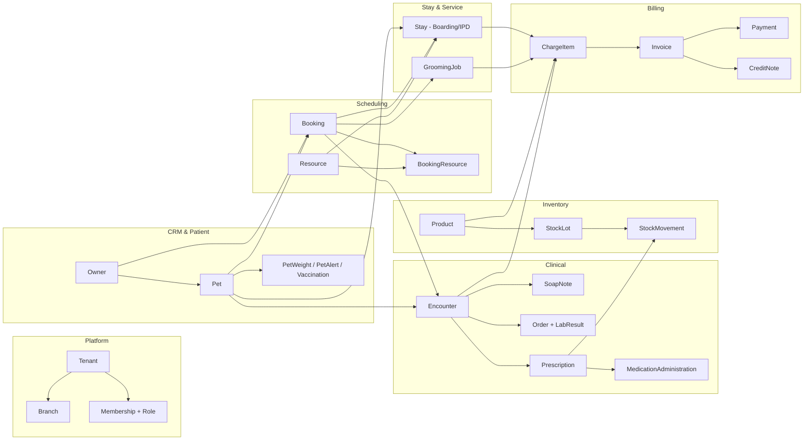
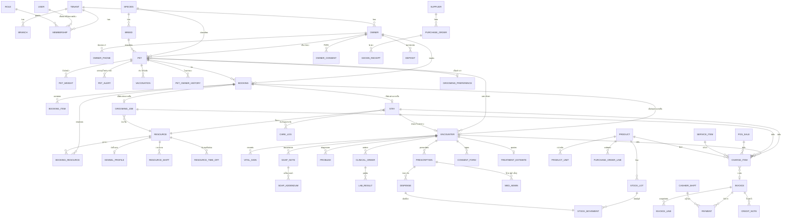
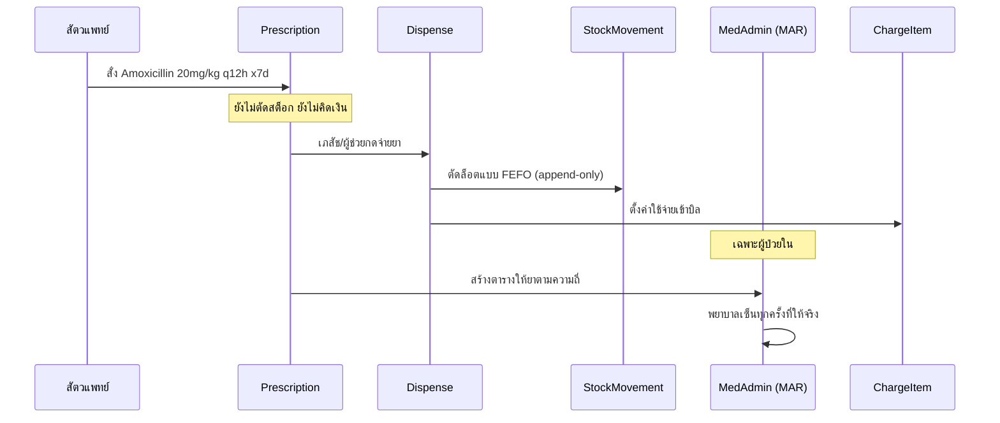

# 02 — โมเดลข้อมูล

สคีมาฉบับเต็มอยู่ที่ [prisma/schema.prisma](../prisma/schema.prisma) เอกสารนี้อธิบาย
**เหตุผล** เบื้องหลังโครงสร้าง และข้อจำกัดที่ Prisma เขียนไม่ได้แต่ต้องมีใน migration

## 1. กติกาการออกแบบข้อมูล 8 ข้อ

1. **`tenantId` อยู่ทุกตารางของคลินิก** และเป็นคอลัมน์แรกของ composite index เสมอ
   แม้จะดูซ้ำซ้อน (เช่น `PetWeight` อ้าง `Pet` อยู่แล้ว) — เพราะ RLS ต้องตรวจที่ตารางนั้นตรง ๆ
2. **เงินเป็น `Int` หน่วยสตางค์** ชื่อฟิลด์ลงท้าย `Satang` เสมอ ห้าม `Float`/`Decimal` ผสม
   (`Int` รองรับถึง ~21.4 ล้านบาทต่อฟิลด์ เพียงพอกับบิลคลินิก; รายงานรวมยอดให้ cast เป็น `BigInt`)
3. **ปริมาณสต็อกเป็น `Decimal(14,4)` หน่วยฐาน** เพราะต้องรองรับ 0.25 เม็ด หรือ 2.5 ml
4. **เวลาเก็บเป็น `timestamptz` (UTC)** แปลงเป็น Asia/Bangkok ที่ชั้นแสดงผลเท่านั้น
   ยกเว้น "วันที่ทางธุรกิจ" เช่น วันคิดค่าห้อง ใช้ `date` ตามเวลาไทย
5. **เอกสารการเงินและเวชระเบียนไม่ hard delete** ใช้ `status = VOID` หรือ addendum
   ข้อมูล master อื่น ๆ ใช้ soft delete ด้วย `deletedAt`
6. **ตารางที่เป็นบัญชีเดินสะพัดเขียนอย่างเดียว (append-only)** — `StockMovement`,
   `AuditLog`, `OutboxEvent` ห้าม UPDATE/DELETE บังคับด้วย trigger
7. **Snapshot ค่าที่ต้องคงอยู่** — `InvoiceLine` คัดลอกชื่อ/ราคา/อัตราภาษีมาเก็บ
   ไม่อ้าง `Product.price` ปัจจุบัน เพราะราคาจะเปลี่ยน แต่บิลเก่าต้องเหมือนเดิมตลอดไป
8. **Primary key เป็น UUID v7** (เรียงตามเวลา ทำให้ index ไม่แตกกระจายเหมือน v4)
   แต่เอกสารที่มนุษย์ต้องอ้างอิงมี `code`/`number` แยกต่างหาก

## 2. ภาพรวมโดเมนและความสัมพันธ์



## 3. ER Diagram — โดเมนหลัก



## 4. การตัดสินใจเชิงโมเดลที่สำคัญ

### 4.1 `Booking` แยกจากสิ่งที่เกิดขึ้นจริง

การจองกับการให้บริการเป็นคนละเรื่อง ลูกค้าจองแล้วไม่มาเป็นเรื่องปกติ และคนที่ walk-in
ก็ไม่มีการจอง จึงแยก:

| ชนิดบริการ | ตอนจอง | ตอนมาถึงจริง |
| --- | --- | --- |
| ตรวจรักษา | `Booking(type=CONSULT)` | `Encounter` |
| ฝากเลี้ยง | `Booking(type=BOARDING)` | `Stay(type=BOARDING)` |
| อาบน้ำตัดขน | `Booking(type=GROOMING)` | `GroomingJob` |
| นอนโรงพยาบาล | ไม่มีการจอง (สั่งจากเคส) | `Stay(type=HOSPITAL)` + `Encounter` |

`Booking` ถือเวลา ทรัพยากรที่กัน และรายการบริการที่ขอ ส่วนตารางปลายทางถือสิ่งที่เกิดจริง
walk-in สร้างตารางปลายทางได้เลยโดยไม่มี `bookingId`

### 4.2 กรงและห้องเป็น `Resource` ตัวเดียวกับหมอและช่าง

ทุกอย่างที่ "จองเวลาได้" คือ `Resource` (`VET`, `GROOMER`, `EXAM_ROOM`, `KENNEL`,
`GROOMING_STATION`, `EQUIPMENT`) ทำให้ปฏิทิน การเช็คชนกัน และ availability API
ใช้โค้ดชุดเดียว กรงมีคุณสมบัติเพิ่ม (ขนาด โซน รองรับสัตว์ชนิดใด) เก็บใน `KennelProfile`
แบบ 1:1

**การกันจองซ้อนบังคับที่ฐานข้อมูล** ไม่ใช่แค่เช็คในโค้ด:

```sql
CREATE EXTENSION IF NOT EXISTS btree_gist;

ALTER TABLE "BookingResource"
  ADD CONSTRAINT no_double_booking
  EXCLUDE USING gist (
    resource_id WITH =,
    tstzrange(start_at, end_at, '[)') WITH &&
  ) WHERE (status <> 'CANCELLED');
```

ทำแบบเดียวกันกับ `Stay` (กรงหนึ่งมีสัตว์ตัวเดียวต่อช่วงเวลา) — เว้นแต่กรงที่ตั้ง
`allowSharing = true` สำหรับสัตว์บ้านเดียวกัน ซึ่งกรณีนั้นใช้ partial index แยก

### 4.3 สั่งยา / จ่ายยา / ให้ยา เป็น 3 ตาราง



ถ้ายุบสามอย่างนี้เป็นตารางเดียวจะเจอปัญหาทันทีเมื่อ: จ่ายยาไม่ครบจำนวนที่สั่ง,
คืนยาที่ยังไม่ได้ให้, ยาที่ต้องให้ทุก 8 ชม. เป็นเวลา 5 วัน (15 ครั้ง) หรือยาที่สั่งแล้วหมอยกเลิก

### 4.4 `ChargeItem` — จุดรวมเงินจากทุกโมดูล

```
Encounter  ─┐
Stay       ─┤
GroomingJob─┼─→ ChargeItem (status=OPEN) ─→ Invoice ─→ Payment
PosSale    ─┤        ▲
Booking    ─┘        └─ มาจาก ServiceItem หรือ Product
(มัดจำ)
```

`ChargeItem` ผูกกับ `ownerId` (คนจ่าย) และ `petId` (สัตว์ที่รับบริการ — nullable
เพราะการขายของหน้าร้านอาจไม่ผูกสัตว์) มีฟิลด์ `sourceType` + `sourceId` ชี้กลับต้นทาง
ทำให้รายงาน "รายได้แยกตามแผนก" คำนวณได้โดยไม่ต้อง join หลายทาง

**ทำไมไม่ตั้งค่าใช้จ่ายลง `Invoice` ตรง ๆ:** เพราะระหว่างที่สัตว์ยังฝากอยู่ 5 คืน
ยังไม่ควรมี invoice บิลจะออกตอนเช็คเอาท์ครั้งเดียว แต่ค่าใช้จ่ายเกิดขึ้นทุกวัน

### 4.5 เวชระเบียนแก้ไม่ได้ ใช้ addendum

`SoapNote` เมื่อ `signedAt` ไม่เป็น null แล้วจะแก้ไม่ได้ ต้องเพิ่ม `SoapAddendum`
ที่อ้างโน้ตเดิม พร้อมผู้แก้และเหตุผล การแสดงผลจะเรียงต่อกันให้เห็นทั้งฉบับเดิมและส่วนแก้

### 4.6 หน่วยนับหลายชั้น

ยา 1 กล่อง = 10 แผง = 100 เม็ด ซื้อเป็นกล่อง ขายเป็นเม็ด นับสต็อกเป็นเม็ด

```
Product.baseUnit = "เม็ด"
ProductUnit: [ {unit:"เม็ด", factor:1, sale:true},
               {unit:"แผง", factor:10, sale:true},
               {unit:"กล่อง", factor:100, purchase:true} ]
```

`StockMovement.qtyBase` เก็บเป็นหน่วยฐานเสมอ ส่วน UI แสดงหน่วยที่คนใช้สะดวก
ป้องกันความผิดพลาดคลาสสิกที่รับเข้า 10 กล่องแล้วระบบนึกว่า 10 เม็ด

### 4.7 ประวัติน้ำหนักเป็นตารางแยก

`PetWeight` ไม่ใช่ฟิลด์ใน `Pet` เพราะน้ำหนักคือข้อมูลทางคลินิกที่ต้องดูแนวโน้ม
และการคำนวณขนาดยาต้องอ้างน้ำหนัก ณ วันที่สั่ง ไม่ใช่น้ำหนักล่าสุด
`Pet.currentWeightKg` เก็บเป็น denormalized cache สำหรับแสดงผลเร็ว ๆ เท่านั้น

## 5. ตารางอ้างอิงที่ต้อง seed

| ตาราง | ข้อมูลตั้งต้น |
| --- | --- |
| `Species` | สุนัข, แมว, กระต่าย, หนูแฮมสเตอร์, นก, สัตว์เลื้อยคลาน, เฟอร์เร็ต, อื่น ๆ |
| `Breed` | สายพันธุ์สุนัข/แมวยอดนิยมในไทย ~200 รายการ (พุดเดิ้ล, ชิสุ, ปอมเมอเรเนียน, ไทยหลังอาน, วิเชียรมาศ, สก็อตติชโฟลด์ ...) |
| `DiagnosisCode` | ชุดรหัสวินิจฉัยตามระบบอวัยวะ (แนะนำอิง VeNom Coding) |
| `Permission` | รายการสิทธิ์ทั้งหมดในระบบ (ดู [08-security-and-pdpa.md](08-security-and-pdpa.md)) |
| `Role` | บทบาทสำเร็จรูป 9 แบบ ให้คลินิกคัดลอกไปแก้ได้ |
| `TaxCode` | `VAT7`, `VAT0`, `EXEMPT`, `NONVAT` |
| `NotificationTemplate` | เทมเพลตภาษาไทยสำหรับเตือนนัด/วัคซีน/สรุปการรักษา |

## 6. ดัชนีที่ต้องมี (นอกเหนือจาก FK)

```sql
-- ค้นหาเจ้าของ/สัตว์ (หน้าจอที่ใช้บ่อยที่สุด)
CREATE INDEX ON "Owner" USING gin (search_key gin_trgm_ops);
CREATE INDEX ON "Pet" USING gin (search_key gin_trgm_ops);
CREATE INDEX ON "Pet" (tenant_id, owner_id) WHERE deleted_at IS NULL;

-- ปฏิทินและคิว
CREATE INDEX ON "Booking" (tenant_id, branch_id, start_at) WHERE status <> 'CANCELLED';
CREATE INDEX ON "BookingResource" USING gist (resource_id, tstzrange(start_at, end_at));
CREATE INDEX ON "Encounter" (tenant_id, branch_id, status, arrived_at);

-- ผังกรงและฝากเลี้ยง
CREATE INDEX ON "Stay" (tenant_id, branch_id, status, expected_out_at);

-- สต็อก: ยอดคงเหลือคำนวณจาก ledger ต้องเร็ว
CREATE INDEX ON "StockMovement" (tenant_id, branch_id, product_id, occurred_at);
CREATE INDEX ON "StockLot" (tenant_id, branch_id, product_id, expiry_date)
  WHERE qty_base > 0;

-- การเงิน
CREATE UNIQUE INDEX ON "Invoice" (tenant_id, branch_id, doc_type, number);
CREATE INDEX ON "ChargeItem" (tenant_id, owner_id, status) WHERE status = 'OPEN';
CREATE INDEX ON "Payment" (tenant_id, shift_id);
```

## 7. ยอดคงเหลือสต็อก — ledger + materialized cache

ยอดคงเหลือคือ `SUM(qty_base)` จาก `StockMovement` ซึ่งช้าเมื่อข้อมูลโต จึงเก็บ
`StockOnHand (tenantId, branchId, productId, lotId, qtyBase)` เป็น cache ที่อัปเดต
ด้วย trigger ในทรานแซกชันเดียวกับการเขียน movement และมี job ตรวจสอบความตรงกันทุกคืน

```sql
CREATE OR REPLACE FUNCTION apply_stock_movement() RETURNS trigger AS $$
BEGIN
  INSERT INTO "StockOnHand" (tenant_id, branch_id, product_id, lot_id, qty_base)
  VALUES (NEW.tenant_id, NEW.branch_id, NEW.product_id, NEW.lot_id, NEW.qty_base)
  ON CONFLICT (tenant_id, branch_id, product_id, lot_id)
  DO UPDATE SET qty_base = "StockOnHand".qty_base + EXCLUDED.qty_base;

  IF (SELECT qty_base FROM "StockOnHand"
      WHERE tenant_id = NEW.tenant_id AND branch_id = NEW.branch_id
        AND product_id = NEW.product_id AND lot_id = NEW.lot_id) < 0 THEN
    RAISE EXCEPTION 'สต็อกติดลบ: product %, lot %', NEW.product_id, NEW.lot_id;
  END IF;
  RETURN NEW;
END $$ LANGUAGE plpgsql;
```

ข้อดีคือสต็อกติดลบเป็นไปไม่ได้ในระดับฐานข้อมูล ต่อให้มีสองคนกดจ่ายยาพร้อมกัน

## 8. การเก็บรักษาและลบข้อมูล

| ข้อมูล | ระยะเก็บ | หมายเหตุ |
| --- | --- | --- |
| เวชระเบียน | ไม่น้อยกว่า 5 ปีหลังการรักษาครั้งสุดท้าย | ตั้งค่าได้ต่อคลินิก |
| เอกสารภาษี | 5 ปี (ประมวลรัษฎากร) | ห้ามลบ แม้ปิดบัญชีลูกค้า |
| ไฟล์แนบขนาดใหญ่ (x-ray) | ย้ายไป cold storage หลัง 1 ปี | |
| Audit log | 2 ปีออนไลน์ + archive | |
| ข้อมูลส่วนบุคคลเมื่อลูกค้าขอลบ | ทำ pseudonymization ไม่ใช่ลบทิ้ง | เก็บส่วนที่กฎหมายภาษีบังคับไว้ |
