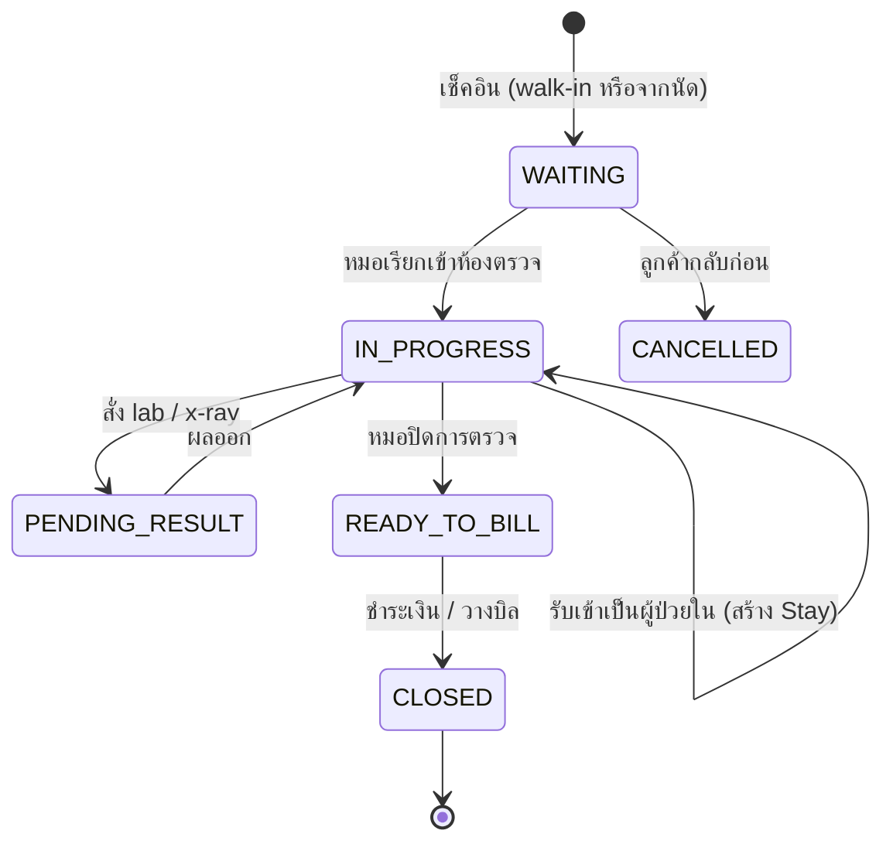
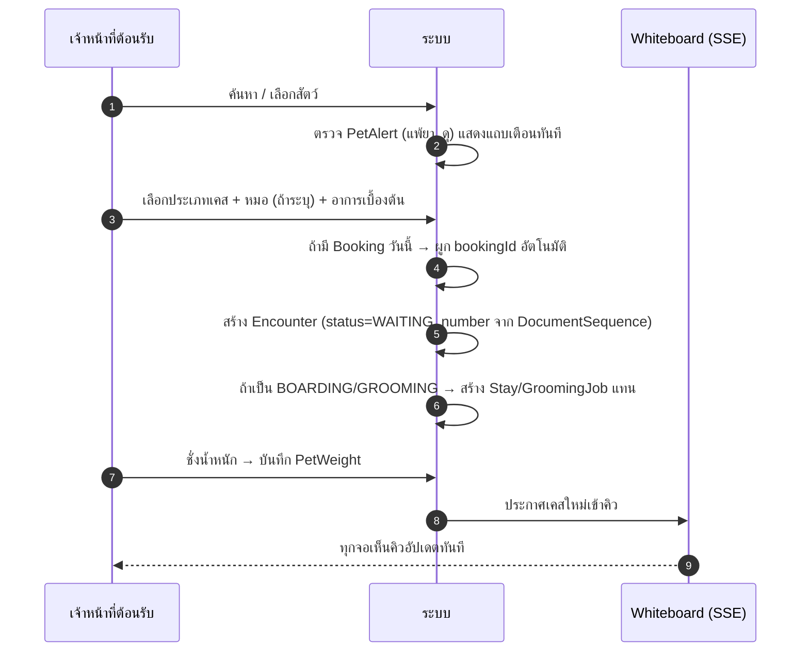
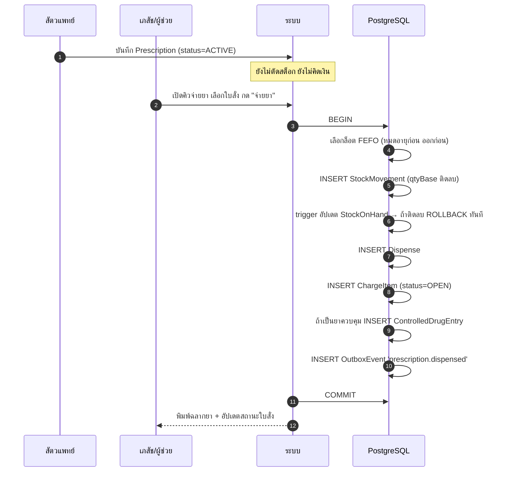
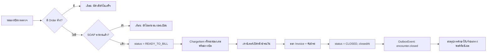

# 03 — งานหน้าคลินิก: รับเคส → ตรวจ → สั่งยา → ปิดเคส

## 1. ภาพรวมเส้นทางของเคสหนึ่ง



## 2. การรับสัตว์เข้าคลินิก (Reception)

### 2.1 หน้าจอเดียวจบ

หน้า `reception` มีช่องค้นหาช่องเดียวที่ค้นพร้อมกันทั้ง เบอร์โทร / ชื่อเจ้าของ / ชื่อสัตว์ /
รหัสสัตว์ / ไมโครชิป ผลลัพธ์แสดงเป็นการ์ด "เจ้าของ + สัตว์ทุกตัว" กดที่สัตว์ตัวไหน
= เช็คอินตัวนั้น

ถ้าไม่พบ → ปุ่ม **สร้างลูกค้าใหม่** เปิดฟอร์มที่กรอกขั้นต่ำเพียง: ชื่อเจ้าของ, เบอร์โทร,
ชื่อสัตว์, ชนิดสัตว์ ที่เหลือกรอกทีหลังได้ (ตอบโจทย์ US-01 ที่ต้องเสร็จใน 60 วินาที)

### 2.2 ลำดับการเช็คอิน



**เหตุผลที่ต้องชั่งน้ำหนักตั้งแต่หน้าเคาน์เตอร์:** ขนาดยาเกือบทั้งหมดคำนวณจากน้ำหนัก
ถ้าปล่อยให้ไปชั่งตอนหมอสั่งยาแล้ว จะเกิดกรณีหมอสั่งยาด้วยน้ำหนักเมื่อ 6 เดือนที่แล้ว

### 2.3 Whiteboard — กระดานสถานะเคส

แสดงเป็นคอลัมน์ตามสถานะ (รอตรวจ / กำลังตรวจ / รอผล / รอชำระเงิน) การ์ดแต่ละใบมี:
ชื่อสัตว์ + ชนิด, เจ้าของ, เวลารอ (เปลี่ยนสีเมื่อเกิน 20 นาที), หมอที่รับผิดชอบ,
ไอคอนเตือนแพ้ยา/ดุ, ห้องตรวจ อัปเดตผ่าน SSE จาก `LISTEN/NOTIFY` ของ Postgres

## 3. หน้าจอตรวจรักษา (Encounter workspace)

เลย์เอาต์ 3 คอลัมน์ ออกแบบให้ใช้บนแท็บเล็ตในห้องตรวจ:

```
┌──────────────┬───────────────────────────┬──────────────────┐
│ แถบซ้าย       │ พื้นที่ทำงานหลัก            │ แถบขวา            │
│ ──────────── │ ───────────────────────── │ ──────────────── │
│ รูป + ข้อมูล   │ [ SOAP ] [ คำสั่ง ] [ ยา ] │ ค่าใช้จ่ายที่เกิด   │
│ สัตว์          │                           │ ในเคสนี้ (สด ๆ)    │
│              │  S: เจ้าของแจ้งว่า...        │                  │
│ ⚠ แพ้ยา:      │  O: T 39.1 HR 120 ...     │ • ตรวจร่างกาย 300 │
│   Penicillin │  A: Otitis externa        │ • CBC 650        │
│              │  P: ...                   │ • Amoxicillin 240│
│ น้ำหนัก 12.4  │                           │ ─────────────── │
│ (กราฟย้อนหลัง)│  [ บันทึกร่าง ] [ ลงนาม ]   │ รวม 1,190 บาท   │
│              │                           │                  │
│ ประวัติเคสเก่า │                           │ [ ส่งไปชำระเงิน ] │
└──────────────┴───────────────────────────┴──────────────────┘
```

**หลักสำคัญ:** แถบขวาแสดงยอดสะสมแบบเรียลไทม์ เพื่อให้หมอเห็นว่ากำลังจะเรียกเก็บเท่าไร
และคุยกับเจ้าของได้ก่อนทำหัตถการเพิ่ม — เป็นสาเหตุอันดับหนึ่งของการทะเลาะกันที่เคาน์เตอร์

### 3.1 SOAP note

- พิมพ์อิสระได้ แต่มี **เทมเพลตตามอาการ** (ท้องเสีย, ผิวหนัง, ตรวจสุขภาพประจำปี, ทำหมัน)
  ที่เติมโครงให้ พร้อม checklist การตรวจร่างกายตามระบบ
- Auto-save เป็นร่างทุก 10 วินาที (ไฟดับ/แท็บเล็ตหลับ ไม่เสียงาน)
- กด **ลงนาม** แล้ว `signedAt` ถูกตั้ง → ตั้งแต่นั้นแก้ไม่ได้ ต้องใช้ addendum
- แสดง SOAP ของเคสก่อนหน้าแบบพับเก็บได้ในหน้าเดียวกัน

### 3.2 คำสั่งการรักษา (Orders)

สั่ง lab / x-ray / หัตถการ → สร้าง `ClinicalOrder` ซึ่ง **ตั้งค่าใช้จ่ายทันทีที่สถานะเป็น
`COMPLETED`** ไม่ใช่ตอนสั่ง (กันกรณีสั่งแล้วยกเลิกก่อนทำ แล้วลูกค้าโดนเก็บเงิน)

ผล lab กรอกได้ 2 ทาง: คีย์ค่าลงฟอร์มตาม panel (มีค่าอ้างอิงตามชนิดสัตว์ให้เทียบ
และไฮไลต์ค่าผิดปกติอัตโนมัติ) หรืออัปโหลดไฟล์ PDF จากเครื่อง

## 4. การสั่งยา — จุดที่ต้องระวังที่สุด

### 4.1 การคำนวณขนาดยา

```
ขนาดต่อครั้ง (mg) = mgPerKg × weightKg
จำนวนหน่วยฐานต่อครั้ง = ขนาดต่อครั้ง (mg) ÷ ความแรงต่อหน่วย (mg/เม็ด)
จำนวนรวม = จำนวนต่อครั้ง × timesPerDay × durationDays
```

**ตัวอย่าง US-07:** Amoxicillin 20 mg/kg, สุนัข 12.4 กก., ยาเม็ด 250 mg, BID × 7 วัน

```
248 mg ต่อครั้ง ÷ 250 mg/เม็ด = 0.992 เม็ด → ปัดตามกติกา = 1 เม็ด
1 × 2 × 7 = 14 เม็ด
```

กติกาการปัดตั้งค่าได้ต่อสินค้า: ปัดเป็นเม็ดเต็ม / ครึ่งเม็ด / เศษหนึ่งส่วนสี่ / ไม่ปัด (ยาน้ำ)
ระบบแสดงทั้งค่าที่คำนวณได้และค่าที่ปัดแล้ว เพื่อให้หมอเห็นว่าเบี่ยงไปเท่าไร

### 4.2 การตรวจสอบความปลอดภัยก่อนบันทึกใบสั่งยา

ระบบเตือน (แต่ไม่บล็อก — หมอเป็นผู้ตัดสินใจ) เมื่อ:

| เงื่อนไข | ระดับ |
| --- | --- |
| สัตว์มี `PetAlert` type `ALLERGY` หรือ `DRUG_REACTION` ตรงกับตัวยานี้ | 🔴 ต้องยืนยันพร้อมเหตุผล |
| ขนาดยาเกินช่วงที่ตั้งไว้สำหรับชนิดสัตว์นั้น | 🔴 ต้องยืนยัน |
| ยาที่ห้ามใช้ในชนิดสัตว์นั้น (เช่น permethrin ในแมว) | 🔴 ต้องยืนยัน |
| ยาซ้ำกับใบสั่งที่ยัง `ACTIVE` อยู่ | 🟡 แจ้งเตือน |
| สัตว์ตั้งท้อง / อายุน้อยกว่าเกณฑ์ | 🟡 แจ้งเตือน |
| สต็อกไม่พอ / ล็อตใกล้หมดอายุก่อนใช้ยาครบ | 🟡 แจ้งเตือน |

ข้อมูลช่วงขนาดยาและข้อห้ามเก็บในตาราง `Product` ส่วนขยาย (เพิ่มในเฟส 2 เป็น
`ProductSafetyRule`) เฟสแรกใช้การตั้งค่าขั้นต่ำ: ช่วง mg/kg ต่อชนิดสัตว์

### 4.3 ฉลากยาภาษาไทย

พิมพ์ลงสติกเกอร์ขนาด 50×30 mm ต่อรายการยา:

```
┌────────────────────────────────────┐
│ คลินิกรักสัตว์ สาขาสุขุมวิท 02-xxx-xxxx │
│ ────────────────────────────────── │
│ ชื่อสัตว์: ข้าวปุ้น (สุนัข) 12.4 กก.     │
│ เจ้าของ: คุณแพร                      │
│ ────────────────────────────────── │
│ Amoxicillin 250 mg  จำนวน 14 เม็ด    │
│ กินครั้งละ 1 เม็ด วันละ 2 ครั้ง        │
│ เช้า-เย็น หลังอาหาร ติดต่อกัน 7 วัน     │
│ ⚠ กินยาให้ครบแม้อาการดีขึ้นแล้ว         │
│ ────────────────────────────────── │
│ 17/09/2569   สพ.ญ. เอก   EXP 03/2570│
└────────────────────────────────────┘
```

`instructionTh` สร้างอัตโนมัติจาก `frequencyCode` + `route` ผ่านตารางแปลภาษาไทย
(`BID` + `PO` → "กินวันละ 2 ครั้ง เช้า-เย็น") แต่หมอแก้ข้อความได้ก่อนพิมพ์

### 4.4 ลำดับการจ่ายยา



ทุกขั้นอยู่ในทรานแซกชันเดียว — เป็นไปไม่ได้ที่จะ "ตัดสต็อกแล้วแต่ลืมคิดเงิน"

### 4.5 กรณีที่ต้องรองรับ

| กรณี | วิธีจัดการ |
| --- | --- |
| จ่ายยาไม่ครบตามที่สั่ง (ยาหมด) | สร้าง `Dispense` เท่าที่จ่ายจริง ใบสั่งเป็น `PARTIALLY_DISPENSED` |
| เจ้าของเอายาคืน | `StockMovement` type `RETURN_IN` + `CreditNote` ถ้าออกบิลไปแล้ว |
| หมอยกเลิกใบสั่งหลังจ่ายยาแล้ว | ยกเลิกไม่ได้ ต้องทำเป็นการคืนยา |
| ยาที่ผสมเอง (compounded) | สร้าง `Product` แบบ compounded ที่ตัดสต็อกวัตถุดิบตามสูตร (เฟส 3) |
| ยาฉีดที่ให้ที่คลินิกเลย | `Dispense` + บันทึก `MedAdmin` พร้อมกันในขั้นตอนเดียว |

## 5. วัคซีน

การฉีดวัคซีนเป็น `Dispense` + `Vaccination` + `ChargeItem` พร้อมกัน สิ่งที่ต้องบันทึกเสมอ:
ชื่อวัคซีน, **เลขล็อต**, วันหมดอายุ, ตำแหน่งที่ฉีด, ผู้ฉีด — เพราะถ้ามีการเรียกคืนล็อต
ต้องหาสัตว์ทุกตัวที่ได้รับล็อตนั้นได้

เมื่อบันทึกแล้ว ระบบ:
1. คำนวณ `nextDueAt` จากตารางวัคซีนตามชนิดสัตว์และอายุ (ลูกสัตว์ 3 เข็มห่าง 3-4 สัปดาห์,
   ตัวเต็มวัยปีละครั้ง)
2. สร้าง `Booking` ประเภท `VACCINE` แบบร่าง หรืออย่างน้อยสร้าง reminder
3. ออก **ใบรับรองการฉีดวัคซีน** PDF ที่มีเลขที่ใบรับรอง ลายเซ็นสัตวแพทย์ และเลขใบอนุญาต
   — ใช้ยื่นตอนเดินทาง/เข้าสถานรับฝาก

## 6. การปิดเคสและส่งไปชำระเงิน



**ข้อกำหนด:** ปิดเคสได้แม้ยังไม่ชำระเงิน (ลูกค้าติดหนี้ / รอเคลมประกัน) สถานะจะเป็น
`CLOSED` แต่ `Invoice.status` เป็น `PARTIALLY_PAID` และค้างในรายงานลูกหนี้

## 7. ผู้ป่วยใน (IPD)

เมื่อหมอตัดสินใจรับสัตว์ไว้นอนโรงพยาบาล จาก `Encounter` กด **รับเข้าเป็นผู้ป่วยใน**:

1. เลือกกรงว่าง (กรองตามขนาดและชนิดสัตว์ กรงแยกโรคสำหรับเคสติดเชื้อ)
2. สร้าง `Stay(type=HOSPITAL)` ผูกกับ `Encounter` เดิม (1:1)
3. `Encounter.type` เปลี่ยนเป็น `IPD` และเคสยังเปิดอยู่จนกว่าจะจำหน่าย
4. ใบสั่งยาที่ `ACTIVE` สร้างตาราง `MedAdmin` อัตโนมัติตามความถี่

### 7.1 ตารางให้ยา (MAR)

หน้าจอ MAR เป็นตารางกริด: แถว = ยา, คอลัมน์ = ช่วงเวลา, ช่อง = ปุ่มเซ็นให้ยา

```
                 08:00   12:00   16:00   20:00   00:00
Amoxicillin 1เม็ด  ✓นาน   ─      ✓นาน   ─      ─
Tramadol 0.5เม็ด   ✓นาน   ✓บี    ⏰รอ    ○      ○
NSS IV 50ml/hr    ═══════ ต่อเนื่อง ══════════════
```

- `⏰` = ถึงเวลาแล้วยังไม่ให้ (เกิน 30 นาที → แจ้งเตือนหัวหน้าเวร)
- กดแล้วบันทึก `administeredAt` + `administeredById` จริง ไม่ใช่เวลาที่กำหนดไว้
- เลือก `REFUSED` / `HELD` พร้อมเหตุผลได้ (สัตว์อาเจียน, หมอสั่งงด)
- ยาที่ให้ในโรงพยาบาลตัดสต็อกตอนให้จริง ไม่ใช่ตอนสั่ง

### 7.2 การจำหน่าย

ปิด `Stay` → คำนวณค่าห้อง + ค่ายา + ค่าหัตถการทั้งหมดของเคสเป็นบิลเดียว
พิมพ์ **ใบสรุปการรักษา (discharge summary)** ที่มีคำแนะนำการดูแลที่บ้าน ยาที่ให้กลับ
และวันนัดติดตามผล

## 8. การจัดการข้อผิดพลาด

| สถานการณ์ | พฤติกรรมระบบ |
| --- | --- |
| เช็คอินสัตว์ที่มีเคสเปิดค้างอยู่ | เตือนและเสนอให้เปิดเคสเดิมแทน |
| หมอสองคนแก้ SOAP เดียวกันพร้อมกัน | Optimistic lock ด้วย `version` — คนที่สองเห็น diff และเลือก merge |
| ปิดเคสที่ยังมี `ChargeItem` ค้าง | ปิดได้ แต่แสดงยอดค้างชัดเจนในคิวรอชำระเงิน |
| ลบสัตว์ที่มีเวชระเบียน | ห้ามลบ — เปลี่ยนเป็น `deletedAt` และซ่อนจากการค้นหาเท่านั้น |
| แก้เวชระเบียนหลังลงนาม | บล็อกที่ชั้น use-case + trigger ระดับ DB บังคับซ้ำ |
