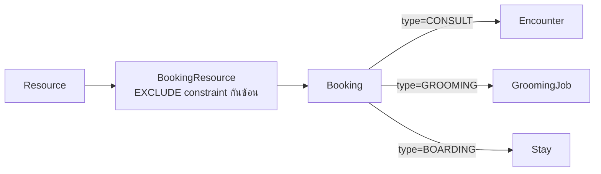
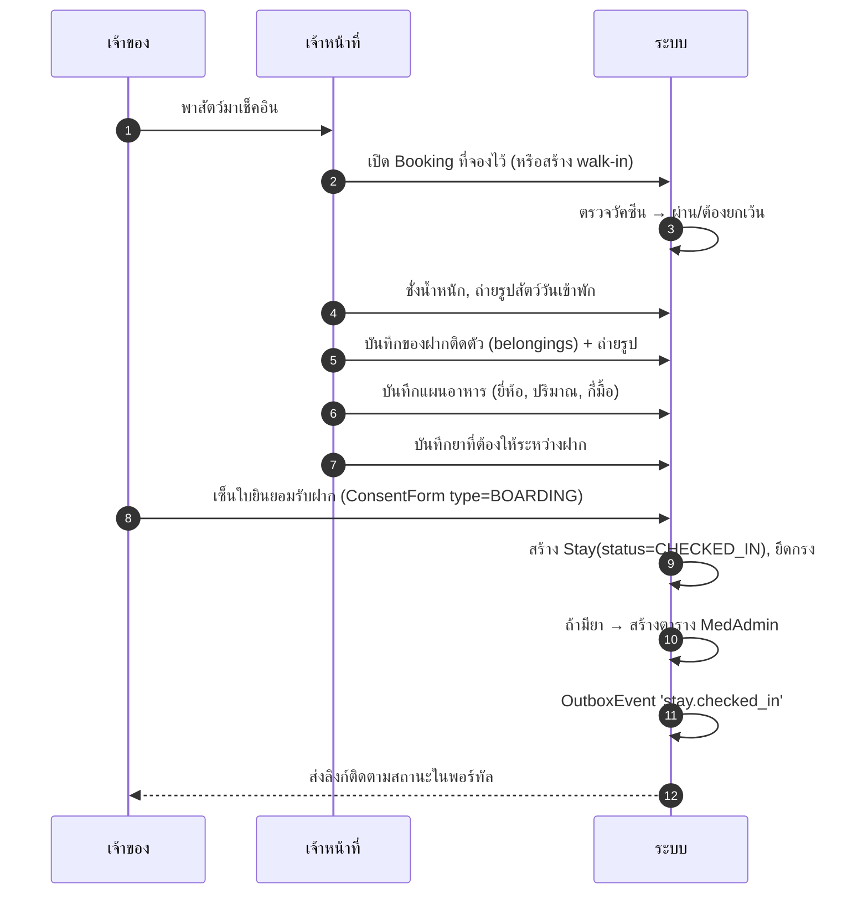
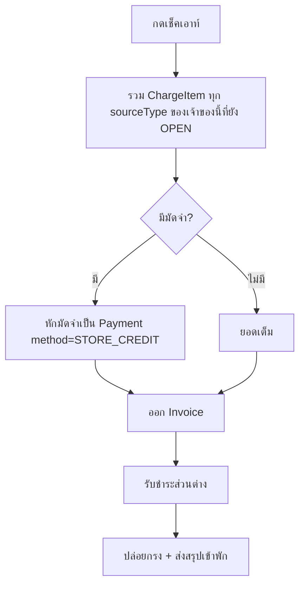
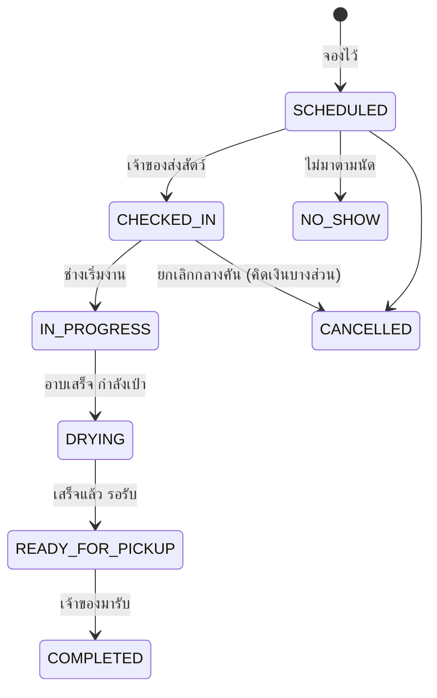

# 04 — ฝากเลี้ยง, ห้องพัก และอาบน้ำตัดขน

## 1. ทำไมสามบริการนี้ใช้โครงเดียวกัน

ฝากเลี้ยง อาบน้ำตัดขน และตรวจรักษา ต่างก็คือ "จองทรัพยากรในช่วงเวลาหนึ่ง แล้วมาใช้บริการจริง"
จึงใช้ `Booking` + `BookingResource` ร่วมกันทั้งหมด ต่างกันแค่ตารางปลายทางเมื่อมาถึงจริง
และหน่วยเวลา (กรูมมิ่งคิดเป็นชั่วโมง ฝากเลี้ยงคิดเป็นคืน)



---

# ส่วนที่ 1 — การฝากเลี้ยง (Boarding)

## 2. ผังกรงและการจัดห้อง

กรงทุกใบเป็น `Resource(type=KENNEL)` + `KennelProfile` ที่บอก ขนาด / โซน / ชนิดสัตว์ที่รับ /
แชร์กรงได้ไหม / อัตราค่าห้องต่อคืน

**หน้าผังกรง (Kennel Board)** แสดงเป็นตารางปฏิทินแนวนอน แถวคือกรง คอลัมน์คือวัน:

```
            17 ก.ย.   18 ก.ย.   19 ก.ย.   20 ก.ย.   21 ก.ย.
โซนสุนัข
 D-01 (L)   ▓▓▓ ข้าวปุ้น ▓▓▓▓▓▓▓▓▓▓▓▓░░░░░░
 D-02 (M)   ░░░░░░░░   ▓▓▓ มะลิ ▓▓▓▓▓▓▓▓▓▓▓▓▓▓▓
 D-03 (M)   ░░░ ว่าง ░░░░░░░░░░░░░░░░░░░░░░░░░
โซนแมว
 C-01       ▓▓▓ เหมียว ▓▓▓░░░░░░░░░░░░░░░░░░
 C-02       🔧 ปิดซ่อม 🔧🔧🔧🔧🔧░░░░░░░░░░░░░
ไอซียู
 ICU-1      ▓▓ โอริโอ้ (IPD) ▓▓▓▓▓▓▓▓░░░░░░░
```

ลากบล็อกเพื่อย้ายกรงได้ → สร้าง `StayKennelMove` และบันทึกเหตุผล
สีแยกตาม: ฝากเลี้ยง / ผู้ป่วยใน / กรงแยกโรค / ปิดซ่อม

## 3. การจองห้องฝาก

### 3.1 ตรวจห้องว่าง

```ts
// modules/boarding/find-available-kennels.ts
// คืนกรงที่ว่างตลอดช่วง [checkIn, checkOut) และรองรับสัตว์ตัวนี้
export async function findAvailableKennels(ctx, input: {
  branchId: string; checkIn: Date; checkOut: Date;
  speciesCode: string; minSize?: KennelSize; needsIsolation?: boolean;
}) {
  return ctx.db.$queryRaw`
    SELECT r.id, r.name, kp.size, kp.zone, kp.daily_rate_service_id
    FROM "Resource" r
    JOIN "KennelProfile" kp ON kp.resource_id = r.id
    WHERE r.branch_id = ${input.branchId}::uuid
      AND r.type = 'KENNEL'
      AND r.is_active AND NOT kp.is_out_of_service
      AND ${input.speciesCode} = ANY(kp.allowed_species_codes)
      AND NOT EXISTS (
        SELECT 1 FROM "Stay" s
        WHERE s.kennel_resource_id = r.id
          AND s.status IN ('RESERVED','CHECKED_IN')
          AND tstzrange(COALESCE(s.check_in_at, s.expected_out_at),
                        COALESCE(s.check_out_at, s.expected_out_at), '[)')
              && tstzrange(${input.checkIn}, ${input.checkOut}, '[)')
      )
      AND NOT EXISTS (
        SELECT 1 FROM "BookingResource" br
        WHERE br.resource_id = r.id AND br.status = 'ACTIVE'
          AND tstzrange(br.start_at, br.end_at, '[)')
              && tstzrange(${input.checkIn}, ${input.checkOut}, '[)')
      )
    ORDER BY kp.size, r.sort_order`;
}
```

การกันจองซ้อนย้ำอีกชั้นด้วย `EXCLUDE USING gist` ที่ฐานข้อมูล — ต่อให้สองคนกดจองกรงเดียวกัน
พร้อมกันเป๊ะ ๆ คนที่สองจะได้ error ไม่ใช่ได้กรงซ้อน

### 3.2 นโยบายที่ตั้งค่าได้ต่อคลินิก

| นโยบาย | ค่าเริ่มต้น | หมายเหตุ |
| --- | --- | --- |
| ต้องมัดจำกี่ % ตอนจอง | 30% ของค่าห้องทั้งหมด | 0 = ไม่เก็บมัดจำ |
| ยกเลิกฟรีได้ถึงเมื่อไร | ก่อนถึงวันเข้าพัก 48 ชม. | หลังจากนั้นริบมัดจำ |
| ต้องตรวจสมุดวัคซีนก่อนรับ | เปิด | ต้องมีวัคซีนหลักที่ยังไม่หมดอายุ |
| เวลาเช็คอิน / เช็คเอาท์มาตรฐาน | 10:00 / 12:00 | เกินเวลาคิดค่าปรับ |
| คิดค่าห้องเมื่อเกินเวลาเช็คเอาท์ | ครึ่งวันถ้าเกินถึง 18:00, เต็มวันหลังจากนั้น | |
| รับสัตว์ที่ยังไม่ทำหมัน / ตั้งท้อง | ต้องอนุมัติเป็นราย ๆ | |

**การตรวจวัคซีนก่อนรับฝาก** เป็นการตรวจที่ระบบทำให้อัตโนมัติ: เช็ก `Vaccination` ว่ามี
วัคซีนหลัก (พิษสุนัขบ้า + วัคซีนรวม) ที่ `nextDueAt` ยังไม่ถึงกำหนด ถ้าไม่ผ่านจะเตือน
และต้องมีผู้มีสิทธิ์กดยกเว้นพร้อมเหตุผล → บันทึกลง `AuditLog`

## 4. การเช็คอิน



**ของฝากติดตัว (belongings)** สำคัญกว่าที่คิด — ผ้าห่ม ของเล่น ชามอาหาร สายจูง
เป็นสาเหตุข้อพิพาทประจำ เก็บเป็น JSON พร้อมรูปถ่าย และให้เจ้าของเซ็นรับตอนเช็คเอาท์

## 5. การดูแลรายวันและการคิดค่าห้อง

### 5.1 บันทึกดูแล (CareLog)

พนักงานบันทึกผ่านมือถือ: ให้อาหาร (กินหมด/เหลือ/ไม่กิน), พาเดิน, ขับถ่าย, ให้ยา,
ทำความสะอาด, สังเกตอาการ พร้อมถ่ายรูปได้

ทุกบันทึกที่ติดธง `sharedToOwnerAt` จะไปโผล่ในพอร์ทัลของเจ้าของ — เป็นฟีเจอร์ที่
ลูกค้าชอบมากและช่วยลดสายโทรเข้ามาถาม

### 5.2 งานคิดค่าห้องรายวัน

```ts
// server/jobs/accrue-boarding-charges.ts
// รันทุกวันเวลา 00:05 น. ตามเวลาไทย
export async function accrueBoardingCharges(tenantId: string, businessDate: Date) {
  const stays = await findActiveStays(tenantId, businessDate);

  for (const stay of stays) {
    // idempotent: ข้ามถ้าคิดถึงวันนี้แล้ว — job รันซ้ำได้ไม่เกิดรายการซ้ำ
    if (stay.billedThroughDate && stay.billedThroughDate >= businessDate) continue;

    await db.$transaction(async (tx) => {
      await createChargeItem(tx, {
        sourceType: 'STAY', stayId: stay.id,
        itemType: 'SERVICE', serviceItemId: stay.dailyRateServiceId,
        description: `ค่าห้องพัก ${stay.kennel.name} วันที่ ${formatThaiDate(businessDate)}`,
        qty: 1, unitPriceSatang: stay.dailyRateSatang,
        occurredAt: businessDate,
      });
      await tx.stay.update({
        where: { id: stay.id },
        data: { billedThroughDate: businessDate },
      });
    });
  }
}
```

**ความสำคัญของ `billedThroughDate`:** งานตามเวลาจะรันซ้ำเสมอไม่วันใดก็วันหนึ่ง
(เซิร์ฟเวอร์รีสตาร์ท, deploy, retry) ถ้าไม่มีตัวกันซ้ำ ลูกค้าจะโดนคิดค่าห้องสองรอบ

### 5.3 การคิดจำนวนคืน

นับตามจำนวน "คืนที่ค้าง" ไม่ใช่จำนวนวัน: เข้า 17 ก.ย. ออก 20 ก.ย. = 3 คืน
บวกค่าปรับถ้าเช็คเอาท์เกินเวลามาตรฐาน กติกาตั้งค่าได้ที่ระดับคลินิก

## 6. การเช็คเอาท์

1. ตรวจของฝากติดตัวครบ → เจ้าของเซ็นรับ
2. ระบบรวบ `ChargeItem` ทั้งหมดที่ `sourceType='STAY'` ของ stay นี้
   **บวกกับ** รายการอื่นที่เกิดระหว่างฝาก (อาบน้ำ, ยา, ของที่ซื้อกลับบ้าน) ตาม US-12
3. หัก `Deposit` ที่จ่ายตอนจอง
4. ออกบิลเดียว → ชำระเงิน → `Stay.status = CHECKED_OUT`, ปล่อยกรง
5. ส่งสรุปการเข้าพัก + รูปถ่ายให้เจ้าของ



---

# ส่วนที่ 2 — อาบน้ำตัดขน (Grooming)

## 7. โครงสร้างงานกรูมมิ่ง

`GroomingJob` ผูกกับ `Resource(type=GROOMER)` เป็นหลัก และ `GROOMING_STATION` เป็นทางเลือก
(คลินิกเล็กมีช่างคนเดียวก็ไม่ต้องใช้ station)

### สถานะงาน



แต่ละครั้งที่เปลี่ยนสถานะเป็น `READY_FOR_PICKUP` → ส่งแจ้งเตือนเจ้าของอัตโนมัติ
พร้อมรูป "หลังตัด" ซึ่งเป็นสิ่งที่ลูกค้าอยากเห็นที่สุด

## 8. การจัดคิวช่าง

ระยะเวลาต่องานมาจาก `ServiceItem.durationMinutes` ปรับตามขนาดสัตว์:

| บริการ | พุดเดิ้ลทอย | โกลเด้น | แมวขนยาว |
| --- | --- | --- | --- |
| อาบน้ำ-เป่าแห้ง | 45 นาที | 90 นาที | 60 นาที |
| อาบน้ำ + ตัดขนเต็มตัว | 120 นาที | 180 นาที | 150 นาที |
| ตัดเล็บ/แคะหู อย่างเดียว | 15 นาที | 20 นาที | 20 นาที |

เก็บเป็น `ServiceDurationRule (serviceItemId, speciesCode, weightMin, weightMax, minutes)`
— เพิ่มในเฟส 2; เฟสแรกใช้ `durationMinutes` ค่าเดียวต่อบริการ แล้วให้เจ้าหน้าที่ปรับเอง

## 9. การ์ดประจำตัวสัตว์ (GroomingPreference)

ข้อมูลที่ช่างต้องรู้ทันทีที่เปิดงาน — เก็บครั้งเดียวใช้ตลอด:

```
🐩 ข้าวปุ้น — พุดเดิ้ลทอย 4.2 กก.
   สไตล์ประจำ: เทดดี้แบร์ หน้ากลม
   ใบมีด: #7F ลำตัว, กรรไกรที่หน้า-หาง
   ⚠ ห้ามตัดหนวด (เจ้าของสั่ง)
   ⚠ กลัวเสียงไดร์ — ใช้โหมดลมเบา
   😾 งับเวลาตัดเล็บหลัง ต้องมีคนช่วยจับ
   แชมพู: สูตรผิวแพ้ง่าย (ยี่ห้อ X)
   ช่างประจำ: ช่างบี
```

`needsMuzzle` และ `temperamentNote` แสดงเป็นแถบเตือนสีแดง — เรื่องความปลอดภัยของช่าง

## 10. รูปก่อน-หลัง และการส่งต่อให้สัตวแพทย์

- ถ่ายรูปก่อนเริ่มงาน (หลักฐานสภาพขน/บาดแผลที่มีอยู่เดิม) และหลังเสร็จ
- ช่างเป็นคนที่ได้สัมผัสตัวสัตว์ทั่วที่สุด จึงมีช่อง **`skinFindings`** ให้บันทึกสิ่งที่พบ
  (ก้อนเนื้อ ผื่น หู้อักเสบ เห็บหมัด) พร้อมปุ่ม **"ส่งให้หมอดู"** ที่สร้าง
  `PetAlert` หรือเปิด `Booking` ประเภท `CONSULT` ให้เลย
- `foundParasites = true` → เตือนให้แจ้งเจ้าของและเสนอยากำจัดปรสิต (ขายของได้ด้วย)

## 11. การคิดเงินกรูมมิ่ง

ราคาขึ้นกับ ชนิด × สายพันธุ์ × น้ำหนัก × สภาพขน สังกะตังคิดเพิ่ม ระบบจึงเสนอราคาตั้งต้น
จาก `ServiceItem` แล้วให้ช่าง/เคาน์เตอร์ปรับ พร้อมบันทึกเหตุผลถ้าปรับเกินเกณฑ์

รายการเสริมที่ขายพ่วงได้ (แสดงเป็นปุ่มลัดในหน้างาน): ตัดเล็บ, แคะหู, ขัดฟัน, สปาโคลนพอก,
บำรุงขน, กำจัดเห็บหมัด, ต่อมข้างก้น — ทุกอย่างกลายเป็น `ChargeItem` ที่ `sourceType='GROOMING'`

## 12. ความสัมพันธ์กับโมดูลอื่น

| เหตุการณ์ | ผลต่อโมดูลอื่น |
| --- | --- |
| สัตว์ที่ฝากเลี้ยงขออาบน้ำ | สร้าง `GroomingJob` แยก แต่ `ChargeItem` ไปรวมที่บิลเดียวกันตอนเช็คเอาท์ |
| ช่างพบก้อนเนื้อ | สร้าง `PetAlert` + เสนอเปิด `Booking` ตรวจ |
| แชมพูยาที่ใช้ | ตัดสต็อกเป็น `StockMovement` type `INTERNAL_USE` หรือคิดเงินตามนโยบาย |
| ตัดขนเสร็จ | ตั้ง `nextDueWeeks` → สร้าง reminder ให้จองรอบหน้า |
| สัตว์ดุ ทำร้ายช่าง | บันทึก `incidentNote` + สร้าง `PetAlert` type `BEHAVIOUR` |
