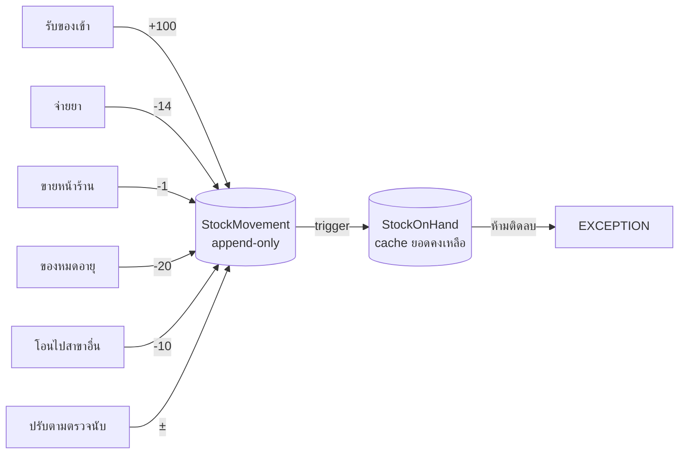
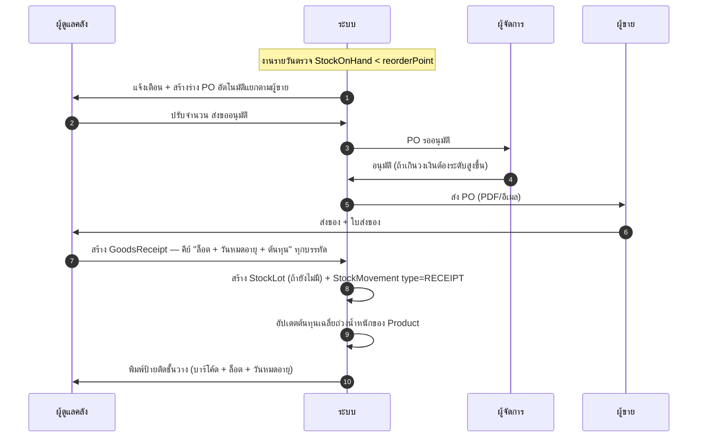
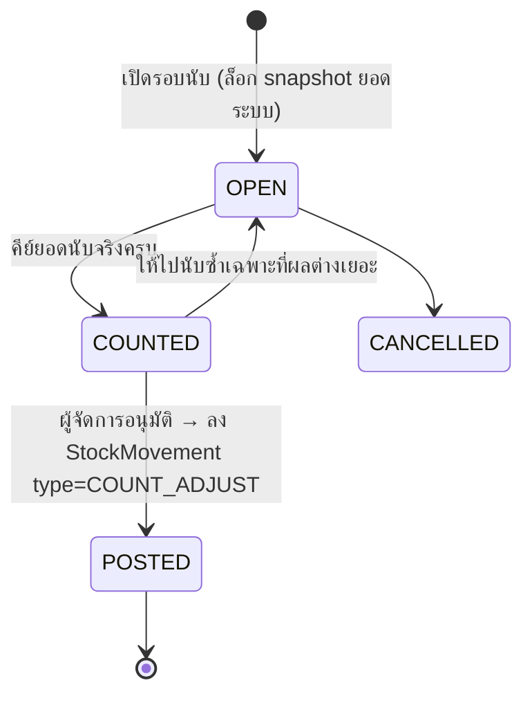

# 05 — คลังสินค้าและเภสัชกรรม

## 1. หลักการ: สต็อกคือบัญชีเดินสะพัด

ยอดคงเหลือไม่ใช่ตัวเลขที่เก็บแล้ว `UPDATE` ไปเรื่อย ๆ แต่คือผลรวมของรายการเคลื่อนไหว

```
ยอดคงเหลือ = Σ StockMovement.qtyBase   (บวก = เข้า, ลบ = ออก)
```

เหตุผล:
- **ตรวจย้อนหลังได้ 100%** — "ทำไม Amoxicillin หายไป 30 เม็ด" ตอบได้ทันทีว่าใครเบิกเมื่อไร ให้สัตว์ตัวไหน
- **ไม่มี race condition** — สองคนกดจ่ายยาพร้อมกันได้ ไม่เกิด lost update
- **แก้ย้อนหลังไม่ได้** — ผิดแล้วต้องลงรายการปรับปรุง ซึ่งเป็นสิ่งที่ผู้ตรวจสอบต้องการ

`StockOnHand` เป็นเพียง cache ที่ trigger อัปเดตให้ในทรานแซกชันเดียวกัน พร้อม
`RAISE EXCEPTION` เมื่อยอดจะติดลบ — สต็อกติดลบจึงเป็นไปไม่ได้ในระดับฐานข้อมูล



## 2. หน่วยนับหลายชั้น

ปัญหาจริงของคลินิก: **ซื้อเป็นกล่อง จ่ายเป็นเม็ด นับเป็นเม็ด แต่สั่งซื้อเป็นกล่อง**

```
Product: Amoxicillin 250 mg
  baseUnit = "เม็ด"          ← ทุกอย่างในระบบนับเป็นหน่วยนี้
  ProductUnit:
    เม็ด    factor = 1     ขายได้  ราคา 12.00 บาท
    แผง    factor = 10    ขายได้  ราคา 110.00 บาท
    กล่อง  factor = 100   ซื้อ    ต้นทุน 800.00 บาท
```

**กฎเหล็ก:** `StockMovement.qtyBase`, `StockOnHand.qtyBase`, `Prescription.totalQtyBase`
เก็บเป็นหน่วยฐานเสมอ การแปลงหน่วยทำที่ขอบ (ตอนรับเข้า / ตอนแสดงผล) เท่านั้น
นี่คือจุดที่ระบบสต็อกส่วนใหญ่พัง — รับเข้า 10 กล่อง แล้วระบบนึกว่า 10 เม็ด

```ts
// modules/inventory/units.ts
export function toBase(qty: Decimal, unit: ProductUnit): Decimal {
  return qty.mul(unit.factorToBase);
}
export function fromBase(qtyBase: Decimal, unit: ProductUnit): Decimal {
  return qtyBase.div(unit.factorToBase);
}
/// แสดงผลแบบอ่านง่าย: 247 เม็ด → "2 กล่อง 4 แผง 7 เม็ด"
export function formatMixedUnits(qtyBase: Decimal, units: ProductUnit[]): string { /* ... */ }
```

## 3. ล็อตและวันหมดอายุ (FEFO)

ยาและวัคซีนต้องติดตามเป็นล็อต เพราะ:
- ถ้าผู้ผลิตเรียกคืนล็อต ต้องหาสัตว์ทุกตัวที่ได้รับล็อตนั้น
- ต้องจ่ายของที่ **หมดอายุก่อน ออกก่อน** (First-Expired-First-Out) ไม่ใช่ FIFO ตามวันรับเข้า

```ts
// modules/inventory/pick-lots-fefo.ts
export async function pickLotsFEFO(
  tx: Tx, branchId: string, productId: string, needBase: Decimal,
): Promise<LotPick[]> {
  const lots = await tx.$queryRaw<LotRow[]>`
    SELECT soh.lot_id, soh.qty_base, l.lot_no, l.expiry_date, l.unit_cost_satang
    FROM "StockOnHand" soh
    JOIN "StockLot" l ON l.id = soh.lot_id
    WHERE soh.branch_id = ${branchId}::uuid
      AND soh.product_id = ${productId}::uuid
      AND soh.qty_base > 0
      AND NOT l.is_quarantined
      AND (l.expiry_date IS NULL OR l.expiry_date > CURRENT_DATE)
    ORDER BY l.expiry_date ASC NULLS LAST, l.received_at ASC
    FOR UPDATE`;                            // ล็อกแถวกันแย่งล็อตเดียวกัน

  const picks: LotPick[] = [];
  let remaining = needBase;
  for (const lot of lots) {
    if (remaining.lte(0)) break;
    const take = Decimal.min(remaining, lot.qty_base);
    picks.push({ lotId: lot.lot_id, qtyBase: take, lotNo: lot.lot_no });
    remaining = remaining.sub(take);
  }
  if (remaining.gt(0)) {
    throw new InsufficientStockError(productId, needBase, needBase.sub(remaining));
  }
  return picks;                              // จ่ายข้ามล็อตได้ในครั้งเดียว
}
```

### การเตือนของใกล้หมดอายุ

งานรายวันตรวจ `StockLot` แล้วแจ้งเตือนเป็นระดับ:

| เหลืออายุ | การกระทำ |
| --- | --- |
| ≤ 90 วัน | ขึ้นในรายงาน "ของใกล้หมดอายุ" |
| ≤ 30 วัน | แจ้งผู้ดูแลคลัง + แนะนำให้ใช้ก่อน (ขึ้นป้ายในหน้าจ่ายยา) |
| ≤ 7 วัน | เตือนซ้ำทุกวัน |
| หมดอายุแล้ว | กันออกจากการจ่ายอัตโนมัติ + ให้ลงรายการ `WASTE` พร้อมพยาน |

## 4. การจัดซื้อและรับของ



**บังคับกรอกล็อตและวันหมดอายุ** สำหรับสินค้าประเภท `DRUG` และ `VACCINE` เสมอ
สินค้าประเภท `RETAIL` (ปลอกคอ ของเล่น) ไม่ต้อง — ระบบจะสร้างล็อตเสมือน `NO-LOT` ให้

### ต้นทุนเฉลี่ยถ่วงน้ำหนัก

```
ต้นทุนใหม่ = (คงเหลือเดิม × ต้นทุนเดิม + จำนวนรับเข้า × ต้นทุนใหม่)
             ÷ (คงเหลือเดิม + จำนวนรับเข้า)
```

ใช้คำนวณกำไรขั้นต้นในรายงาน ส่วนต้นทุนรายล็อตยังเก็บไว้ที่ `StockLot.unitCostSatang`
สำหรับคลินิกที่ต้องการวิธี specific identification

## 5. การตรวจนับสต็อก



- ตอนเปิดรอบ ระบบ snapshot `systemQtyBase` ไว้ เพื่อให้ผลต่างคำนวณจากยอด ณ เวลานั้น
  ไม่ใช่ยอดที่ขยับระหว่างนับ
- นับผ่านมือถือด้วยการสแกนบาร์โค้ด นับได้เป็นรายล็อต
- ผลต่างเกินเกณฑ์ (เช่น > 5% หรือ > 1,000 บาท) ต้องมีเหตุผลและผู้อนุมัติระดับผู้จัดการ
- เฉพาะยาควบคุมต้องนับทุกเดือนและมีพยานเซ็นกำกับ

## 6. ยาควบคุม

ยาบางกลุ่มในไทยต้องมีทะเบียนแยก (วัตถุออกฤทธิ์ต่อจิตประสาท, ยาเสพติดให้โทษประเภท 2
เช่น มอร์ฟีน, ketamine, diazepam, tramadol บางสูตร)

เมื่อ `Product.isControlled = true` ระบบบังคับเพิ่ม:

| ข้อกำหนด | การบังคับใช้ |
| --- | --- |
| ทุกการเคลื่อนไหวต้องมี `ControlledDrugEntry` พร้อมยอดคงเหลือหลังรายการ | trigger สร้างอัตโนมัติจาก `StockMovement` |
| ต้องมีผู้ร่วมเป็นพยาน (`witnessId`) ต่างจากผู้จ่าย | ตรวจที่ use-case |
| ต้องระบุสัตว์และผู้สั่งใช้ทุกครั้ง | บังคับที่ฟอร์ม |
| จ่ายได้เฉพาะเมื่อมีใบสั่งจากสัตวแพทย์ที่มีเลขใบอนุญาต | ตรวจ `Membership.licenseNo` |
| นับสต็อกและกระทบยอดทุกเดือน | งานตามเวลา + รายงานบังคับ |
| พิมพ์รายงานทะเบียนตามแบบฟอร์มราชการ | รายงานส่งออก PDF/Excel |
| ห้ามลบทุกกรณี | append-only + `AuditLog` |

> ⚠️ **ต้องตรวจสอบกับเภสัชกร/ผู้รับผิดชอบก่อนใช้งานจริง** ว่ารูปแบบรายงานตรงกับที่
> สำนักงานคณะกรรมการอาหารและยากำหนด ณ ปีที่ใช้งาน เพราะแบบฟอร์มมีการปรับ
> ระบบออกแบบให้เปลี่ยนเทมเพลตรายงานได้โดยไม่ต้องแก้โครงข้อมูล

### 6.1 รูปแบบทะเบียนที่ระบบพิมพ์ (ฉบับเรียบง่าย — ตัดสิน 2026-09-18)

**หนึ่งแผ่น = ยา 1 รายการ × 1 สาขา × 1 เดือน** ไม่รวมยาหลายตัวในแผ่นเดียว
ทุกบรรทัดอ่านจาก `ControlledDrugEntry` ตรง ๆ **ห้ามคำนวณยอดคงเหลือใหม่ตอนพิมพ์**

```
ทะเบียนยาควบคุม — <ชื่อคลินิก> สาขา <ชื่อสาขา>            เดือน กันยายน 2569
ยา: <ชื่อการค้า> (<genericName>) <strength> <dosageForm>   ประเภทควบคุม: <controlledClass>
หน่วยนับ: <baseUnit>                                      ยอดยกมา: 250.0000 เม็ด
```

| # | คอลัมน์ | มาจาก |
| --- | --- | --- |
| 1 | ลำดับ | เรียงตาม `occurredAt` ในเดือนนั้น |
| 2 | วัน-เวลา | `ControlledDrugEntry.occurredAt` (แสดง พ.ศ.) |
| 3 | ประเภทรายการ | `StockMovement.type` แปลเป็นไทย: รับเข้า / จ่ายให้สัตว์ / ขาย / คืน / ปรับปรุง / ทำลาย / ใช้ในคลินิก |
| 4 | เอกสารอ้างอิง | `StockMovement.refType` + เลขที่เอกสารของ ref นั้น (ใบสั่งยา / ใบเสร็จ / ใบรับของ) |
| 5 | ล็อต / วันหมดอายุ | `StockMovement.lot` → `lotNo`, `expiryDate` |
| 6 | สัตว์ (เจ้าของ) | `petId` → ชื่อสัตว์ + รหัส + ชื่อเจ้าของ (เว้นว่างถ้าเป็นรายการคลัง) |
| 7 | ผู้สั่งใช้ + เลขใบอนุญาต | `prescriberId` → ชื่อสัตวแพทย์ + `Membership.licenseNo` |
| 8 | รับเข้า | `qtyBase` เมื่อเป็นบวก |
| 9 | จ่ายออก | `qtyBase` เมื่อเป็นลบ (พิมพ์เป็นค่าสัมบูรณ์) |
| 10 | คงเหลือ | `balanceAfterBase` — **ค่าที่ตรึงไว้ ไม่ใช่ผลรวมที่คำนวณตอนพิมพ์** |
| 11 | ผู้ทำรายการ | `performedById` |
| 12 | พยาน | `witnessId` (ว่าง = รายการที่ไม่ต้องมีพยาน) |
| 13 | หมายเหตุ | `note` / `StockMovement.reason` |

ท้ายแผ่น:

```
ยกมา 250.0000  +  รับเข้า 100.0000  −  จ่ายออก 137.0000  =  คงเหลือตามบัญชี 213.0000 เม็ด
คงเหลือจากการนับจริง ____________   ผลต่าง ____________   เหตุผล ______________________

ผู้จัดทำ ______________   ผู้ควบคุม (เภสัชกร/สัตวแพทย์) ______________   พยาน ______________
วันที่ ______________
```

กติกาการพิมพ์:

1. **ยอดยกมา** = `balanceAfterBase` ของรายการสุดท้ายก่อน 00:00 ของวันที่ 1 ในเดือนนั้น (ไม่ไล่รวมใหม่ตั้งแต่ต้น)
2. ถ้ายอดสรุปที่คำนวณได้ **ไม่ตรง** กับ `balanceAfterBase` แถวสุดท้าย → พิมพ์เครื่องหมาย ⚠ พร้อมตัวเลขทั้งสองค่า **ห้ามแก้ตัวเลขให้ตรงกันเอง** (ledger เป็น append-only, [AGENTS.md §3 ข้อ 6](../AGENTS.md))
3. เดือนที่ยังไม่จบ พิมพ์คำว่า **"ร่าง"** เป็นลายน้ำ
4. ไฟล์ออก: **PDF A4 แนวนอน** และ **CSV คอลัมน์เดียวกัน** ชื่อไฟล์ `controlled-register_<productCode>_<YYYY-MM>_<branchCode>.csv`
5. ปริมาณทุกช่องเป็น**หน่วยฐาน** ทศนิยม 4 ตำแหน่ง พร้อมชื่อหน่วยกำกับหัวกระดาษ ([AGENTS.md §3 ข้อ 7](../AGENTS.md))
6. หน้ารายงานนี้**ไม่มีปุ่มแก้ไขหรือลบ** — แก้ได้ทางเดียวคือลงรายการปรับปรุงใหม่

> ⚠️ นี่คือ **แบบฟอร์มภายในคลินิก** ที่ออกแบบให้ครบข้อมูลที่ต้องใช้ ยังไม่ใช่แบบฟอร์มราชการ
> ก่อนใช้ยื่นหน่วยงานกำกับจริง ต้องให้เภสัชกร/ผู้รับผิดชอบยืนยันว่าตรงกับแบบปีที่ใช้งาน
> ([AGENTS.md §8 ข้อ 2](../AGENTS.md)) — เก็บเทมเพลตแยกจากคิวรี เพื่อเปลี่ยนแบบฟอร์มได้โดยไม่แตะโครงข้อมูล

## 7. สต็อกหลายสาขา

- `StockLot`, `StockOnHand`, `StockMovement` ผูก `branchId` เสมอ — ของอยู่ที่ไหนก็คือที่นั่น
- โอนระหว่างสาขาเป็นสองขา: `TRANSFER_OUT` ที่ต้นทาง → ของอยู่ระหว่างทาง →
  `TRANSFER_IN` เมื่อปลายทางกดรับ (ไม่ใช่ย้ายทันที — ของหายระหว่างทางต้องเห็น)
- `Product` และราคาใช้ร่วมกันทั้ง tenant แต่ราคาต่อสาขาปรับได้ในเฟส 2 ผ่าน `PriceOverride`

## 8. หน้าจอที่ต้องมี

| หน้าจอ | ใครใช้ | สิ่งที่ต้องเห็นทันที |
| --- | --- | --- |
| ภาพรวมคลัง | ผู้ดูแลคลัง | ของต่ำกว่าจุดสั่งซื้อ, ของใกล้หมดอายุ, มูลค่าสต็อกรวม |
| ค้นหาสินค้า | ทุกคน | ยอดคงเหลือแยกล็อต + วันหมดอายุ + ราคาขาย |
| รับของ | ผู้ดูแลคลัง | ฟอร์มคีย์เร็วแบบตาราง สแกนบาร์โค้ดได้ |
| ประวัติการเคลื่อนไหว | ผู้จัดการ | ledger ของสินค้าหนึ่ง กรองตามประเภท/ช่วงเวลา/ผู้ทำรายการ |
| ตรวจนับ | ผู้ดูแลคลัง | หน้าจอมือถือ สแกน-นับ-บันทึก |
| ทะเบียนยาควบคุม | เภสัช/ผู้จัดการ | ยอดคงเหลือ, รายการเดินบัญชี, พิมพ์รายงาน |
| จุดสั่งซื้อและ PO | ผู้ดูแลคลัง | ร่าง PO อัตโนมัติแยกตามผู้ขาย |

## 9. รายงานสำคัญ

| รายงาน | ใช้ตัดสินใจอะไร |
| --- | --- |
| สินค้าคงเหลือและมูลค่า (แยกสาขา/หมวด) | ปิดงบ, ประเมินเงินจม |
| ของใกล้หมดอายุ / หมดอายุแล้ว | จัดโปรระบายของ, ลดของเสีย |
| สินค้าเคลื่อนไหวช้า (ไม่ขยับ 90 วัน) | เลิกสั่ง, ระบายสต็อก |
| กำไรขั้นต้นรายสินค้า | ปรับราคาขาย |
| ยาที่ใช้มากสุด | เจรจาต่อรองกับผู้ขาย |
| ผลต่างจากการตรวจนับย้อนหลัง | หาจุดรั่วไหล |
| ทะเบียนยาควบคุมรายเดือน | ยื่นหน่วยงานกำกับ |
