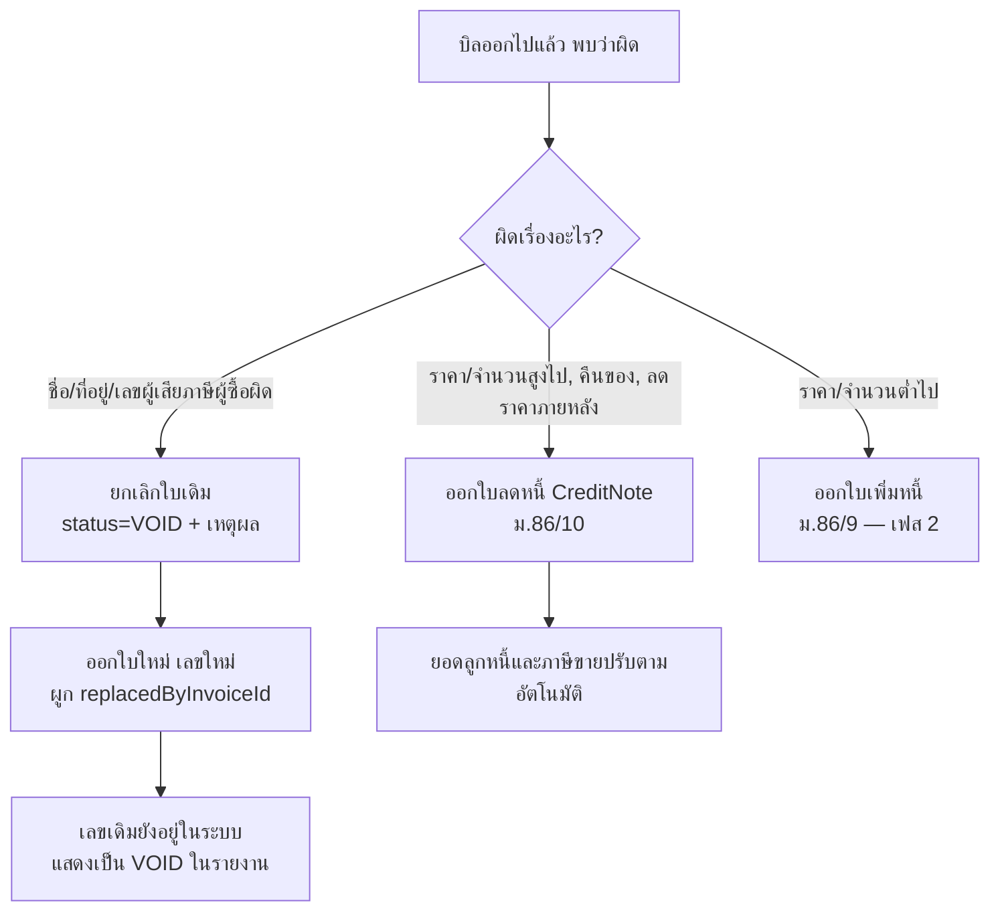
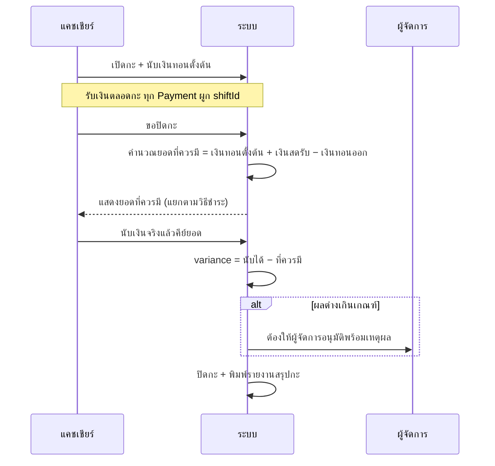

# 06 — ค่าใช้จ่าย, ขายหน้าร้าน, การชำระเงิน และภาษี

> ⚠️ **ข้อจำกัดความรับผิดชอบ:** เอกสารนี้อธิบายการออกแบบระบบให้*รองรับ*ข้อกำหนดทางภาษีไทย
> ไม่ใช่คำแนะนำทางภาษี ก่อนใช้งานจริงต้องให้ผู้ทำบัญชี/ผู้สอบบัญชีของคลินิกตรวจสอบ
> รูปแบบเอกสารและการจัดประเภทภาษีของแต่ละบริการ โดยเฉพาะประเด็นในข้อ 6.2

## 1. เส้นทางของเงินในระบบ

```mermaid
flowchart LR
    subgraph ต้นทาง
      E[Encounter<br/>ตรวจ/ยา/หัตถการ]
      S[Stay<br/>ค่าห้อง/ดูแล]
      G[GroomingJob<br/>อาบน้ำตัดขน]
      P[PosSale<br/>ขายของหน้าร้าน]
      B[Booking<br/>มัดจำ]
    end
    E --> C[ChargeItem<br/>status=OPEN]
    S --> C
    G --> C
    P --> C
    B --> C
    C -->|รวบบิล| I[Invoice<br/>ออกแล้วห้ามแก้]
    I --> PM[Payment<br/>หลายวิธีได้]
    I --> CN[CreditNote<br/>ใบลดหนี้]
    PM --> SH[CashierShift<br/>ปิดกะเงินสด]
    D[Deposit] -.หักลบ.-> PM
```

## 2. ChargeItem — จุดรวมค่าใช้จ่าย

ทุกอย่างที่คิดเงินได้ ไม่ว่าเกิดจากโมดูลไหน จะสร้าง `ChargeItem` หนึ่งบรรทัดที่:

- ผูก `ownerId` (ใครจ่าย) และ `petId` (สัตว์ตัวไหน — nullable สำหรับการขายหน้าร้านทั่วไป)
- ตรึง `unitPriceSatang`, `discountSatang`, `taxCode`, `vatRatePercent`, `amountSatang`
  **ไว้ตั้งแต่ตอนสร้าง** — ราคาเปลี่ยนทีหลังไม่กระทบรายการที่เกิดไปแล้ว
- มี `performedById` เพื่อทำรายงานผลงานหมอ/ช่าง
- มี `sourceType` + id ชี้กลับต้นทาง สำหรับรายงานรายได้แยกแผนก

```ts
// modules/billing/create-charge-item.ts
export async function createChargeItem(tx: Tx, input: CreateChargeInput) {
  const amountSatang = input.unitPriceSatang * toNumber(input.qty) - (input.discountSatang ?? 0);
  if (amountSatang < 0) throw new BusinessError('ยอดรายการติดลบ');
  if (input.discountSatang && input.discountSatang > maxAutoDiscount(input)) {
    requirePermission(input.actor, 'billing:approve_discount');
  }
  return tx.chargeItem.create({ data: { ...input, amountSatang, status: 'OPEN' } });
}
```

### เมื่อไรถึงสร้าง ChargeItem

| โมดูล | ตั้งค่าใช้จ่ายตอนไหน | เหตุผล |
| --- | --- | --- |
| ค่าตรวจ | เปิดเคส | เกิดขึ้นแน่นอน |
| หัตถการ / lab | เมื่อ `ClinicalOrder` เป็น `COMPLETED` | สั่งแล้วยกเลิกได้ ห้ามคิดเงินก่อนทำ |
| ยา | เมื่อ `Dispense` สำเร็จ | ตัดสต็อกกับคิดเงินต้องเกิดพร้อมกัน |
| ค่าห้องฝาก | งานตามเวลาทุกคืน | ค่าห้องสะสมรายวัน |
| กรูมมิ่ง | เมื่อ `GroomingJob` เป็น `COMPLETED` | ราคาสุดท้ายรู้ตอนเสร็จงาน |
| ขายหน้าร้าน | เมื่อสแกนสินค้าลงตะกร้า | ตัดสต็อกตอนปิดการขาย |
| มัดจำ | ตอนยืนยันการจอง | สร้าง `Deposit` คู่กัน |

## 3. การขายหน้าร้าน (POS)

### 3.1 หน้าจอ

```
┌────────────────────────────┬──────────────────────────┐
│ [🔍 สแกน/ค้นหาสินค้า ______] │  ลูกค้า: คุณแพร (ข้าวปุ้น)  │
│                            │  [เปลี่ยน] [ลูกค้าทั่วไป]   │
│ ┌─ หมวดยอดนิยม ─────────┐  │ ─────────────────────── │
│ │ อาหาร │ ของเล่น │ ยา  │  │  อาหารเม็ด 3kg  ×1   890 │
│ │ วิตามิน│ ปลอกคอ │ ทราย│  │  ยาหยดเห็บหมัด ×2   760 │
│ └───────────────────────┘  │  ตัดเล็บ        ×1   150 │
│                            │ ─────────────────────── │
│ ⚠ รายการค้างของลูกค้ารายนี้  │  รวม            1,800   │
│   • ค่าตรวจวันนี้    500    │  ส่วนลด            -50   │
│   • ค่ายา           340    │  ฐานภาษี        1,635.51 │
│   [ ➕ รวมเข้าบิลเดียวกัน ]   │  VAT 7%           114.49 │
│                            │  สุทธิ          1,750.00 │
│                            │  [ ชำระเงิน F12 ]        │
└────────────────────────────┴──────────────────────────┘
```

**จุดออกแบบสำคัญ:** เมื่อเลือกลูกค้าที่มี `ChargeItem` สถานะ `OPEN` ค้างอยู่ ระบบเสนอให้
รวมเข้าบิลเดียวกันทันที — ตอบโจทย์ US-12 ที่ลูกค้าฝากสัตว์ อาบน้ำ และซื้ออาหารกลับบ้าน
ต้องได้ใบเสร็จใบเดียว

### 3.2 ความสามารถที่ต้องมี

- สแกนบาร์โค้ด (รองรับบาร์โค้ดระดับ `ProductUnit` — กล่องกับเม็ดคนละบาร์โค้ด)
- ขายยาที่ `requiresPrescription = true` ต้องเลือกใบสั่งยาหรือมีผู้มีสิทธิ์อนุมัติ
- พักบิลไว้ก่อน (hold) แล้วเรียกกลับมา — ลูกค้าลืมของที่รถ
- ส่วนลดรายบรรทัด / ทั้งบิล / เป็น % หรือจำนวนเงิน พร้อมเพดานที่ต้องขออนุมัติ
- ยกเลิกรายการก่อนปิดการขาย (ยังไม่ตัดสต็อก)
- รับคืนสินค้าพร้อมออกใบลดหนี้

## 4. การชำระเงิน

### 4.1 ชำระหลายวิธีในบิลเดียว

```
ยอดสุทธิ 1,750.00
  เงินสด          500.00
  บัตรเครดิต    1,000.00   (xxxx-1234)
  มัดจำคงเหลือ    250.00   (จาก Deposit #D-0042)
  ─────────────────────
  ยอดคงค้าง         0.00
```

แต่ละวิธีเป็น `Payment` หนึ่งแถว `Invoice.paidSatang` คือผลรวม และ
`balanceSatang = grandTotal − paid` เป็นคอลัมน์ที่คำนวณและตรึงไว้ทุกครั้งที่มีการชำระ

### 4.2 มัดจำ

มัดจำที่รับตอนจองห้องฝากเป็น `Deposit` ไม่ใช่รายได้ทันที เมื่อเช็คเอาท์จึงถูกใช้เป็น
`Payment(method = STORE_CREDIT)` ตัดกับบิลจริง ถ้าลูกค้ายกเลิกตามเงื่อนไขก็คืนเงิน
หรือแปลงเป็นเครดิตในร้าน

### 4.3 การปัดเศษ

ราคาบางรายการทำให้เกิดเศษสตางค์ (เช่น ถอด VAT จากราคารวม) กติกา:

1. คำนวณทุกอย่างเป็นสตางค์ (จำนวนเต็ม) ตลอดทาง
2. **คำนวณ VAT ที่ระดับบิล ไม่ใช่ระดับบรรทัด** — รวมยอดตาม `taxCode` ก่อน แล้วค่อยถอด VAT
   ครั้งเดียวต่อกลุ่ม มิฉะนั้นผลรวมของ VAT รายบรรทัดจะไม่เท่ากับ VAT ของยอดรวม
   (คลาดเคลื่อนหลักสตางค์ ซึ่งผู้สอบบัญชีจะทัก)
3. VAT รายบรรทัดที่แสดงบนเอกสารคือการ **ปันส่วน** ยอด VAT รวมกลับลงบรรทัดตามสัดส่วน
   โดยยัดเศษที่เหลือลงบรรทัดสุดท้าย เพื่อให้ผลรวมตรงเป๊ะเสมอ
4. การปัดเศษเงินสดตั้งค่าได้ต่อคลินิก (ปัดเป็น 0.25 / 0.50 / 1.00 บาท) ส่วนต่างลงเป็น
   บรรทัด "ปัดเศษ" แยก ไม่ไปปนกับฐานภาษี

```ts
// modules/tax/compute-invoice-totals.ts
export function computeTotals(lines: ChargeLine[], profile: TaxProfile): InvoiceTotals {
  const groups = groupBy(lines, (l) => l.taxCode);
  let vatBase = 0, vat = 0, exempt = 0;

  for (const [code, group] of groups) {
    const gross = sum(group, (l) => l.amountSatang);
    if (code === 'VAT7' && profile.isVatRegistered) {
      const rate = profile.vatRatePercent;              // 7
      if (profile.pricesIncludeVat) {
        const base = Math.round((gross * 100) / (100 + rate)); // ปัดครั้งเดียวต่อกลุ่ม
        vatBase += base;
        vat += gross - base;                            // ผลรวมตรงเสมอ ไม่มีเศษหาย
      } else {
        vatBase += gross;
        vat += Math.round((gross * rate) / 100);
      }
    } else {
      exempt += gross;
    }
  }
  const grandTotal = profile.pricesIncludeVat ? sum(lines, l => l.amountSatang)
                                              : vatBase + vat + exempt;
  return { vatBase, vat, exempt, grandTotal };
}
```

## 5. เลขที่เอกสารแบบไม่มีเลขว่าง

เอกสารภาษีต้องมีเลขเรียงลำดับต่อเนื่อง ห้ามข้าม — ถ้าใช้ `MAX(number) + 1` จะชนกัน
เมื่อมีคนออกบิลพร้อมกัน จึงใช้ตาราง `DocumentSequence` ที่ล็อกแถว:

```ts
// modules/tax/next-document-number.ts
export async function nextDocumentNumber(
  tx: Tx, tenantId: string, branchId: string, docType: string, period: string,
) {
  // ล็อกแถวเดียว — คนที่สองรอ ไม่ใช่ได้เลขซ้ำ
  const [row] = await tx.$queryRaw<{ last_number: number }[]>`
    INSERT INTO "DocumentSequence" (tenant_id, branch_id, doc_type, period, last_number)
    VALUES (${tenantId}::uuid, ${branchId}::uuid, ${docType}, ${period}, 1)
    ON CONFLICT (tenant_id, branch_id, doc_type, period)
    DO UPDATE SET last_number = "DocumentSequence".last_number + 1
    RETURNING last_number`;
  return row.last_number;
}
```

**สำคัญ:** เรียกฟังก์ชันนี้ใน**ทรานแซกชันเดียวกับการสร้าง Invoice** และ commit พร้อมกัน
ถ้าทรานแซกชัน rollback เลขจะถูกคืน — ซึ่งอาจทำให้เกิดเลขว่างได้ วิธีป้องกันคือ
**ห้ามจองเลขก่อนยืนยันการออกบิล** (คือ `DRAFT` ยังไม่มีเลข ได้เลขตอนกด "ออกใบกำกับภาษี" เท่านั้น)
และขั้นตอนหลังจากจองเลขต้องไม่มีอะไรที่ล้มเหลวได้ (สร้าง PDF/ส่ง e-Tax ทำแบบ async)

รูปแบบเลขที่แนะนำ: `INV-BKK-2569-000123` = ประเภท-สาขา-ปีพ.ศ.-ลำดับ 6 หลัก
ตั้งค่าได้ที่ `TaxProfile.invoicePrefix`

## 6. ภาษีมูลค่าเพิ่มและเอกสาร

### 6.1 คลินิกจด VAT หรือไม่

ผู้ประกอบการที่มีรายรับเกิน **1.8 ล้านบาทต่อปี** ต้องจดทะเบียนภาษีมูลค่าเพิ่ม
คลินิกเล็กจำนวนมากยังไม่ถึงเกณฑ์ ระบบจึงต้องรองรับทั้งสองแบบผ่าน `TaxProfile.isVatRegistered`:

| สถานะ | เอกสารที่ออก | หน้าตาบิล |
| --- | --- | --- |
| ไม่จด VAT | **ใบเสร็จรับเงิน** | ไม่มีบรรทัด VAT ไม่มีคำว่า "ใบกำกับภาษี" |
| จด VAT — ขายปลีกหน้าร้าน | **ใบเสร็จรับเงิน/ใบกำกับภาษีอย่างย่อ** | ราคารวม VAT แล้ว |
| จด VAT — ลูกค้าขอเต็มรูป | **ใบเสร็จรับเงิน/ใบกำกับภาษี** (เต็มรูป) | แยก VAT ออกจากราคา + ข้อมูลผู้ซื้อครบ |

### 6.2 ⚠️ ประเด็นที่ต้องยืนยันกับผู้ทำบัญชี

การให้บริการรักษาพยาบาลของ **สถานพยาบาลตามกฎหมายว่าด้วยสถานพยาบาล** ได้รับยกเว้น VAT
แต่กฎหมายฉบับนั้นเป็นเรื่องสถานพยาบาลสำหรับคน ส่วนสถานพยาบาลสัตว์อยู่ภายใต้กฎหมาย
คนละฉบับ โดยทั่วไปจึงเข้าใจกันว่า**บริการทางสัตวแพทย์อยู่ในข่ายต้องเสีย VAT**

เนื่องจากเรื่องนี้กระทบเงินโดยตรงและอาจต่างกันตามลักษณะกิจการ ระบบจึงออกแบบให้
**`taxCode` ตั้งได้รายบริการและรายสินค้า** (`VAT7` / `VAT0` / `EXEMPT` / `NONVAT`)
ไม่ฝังสมมติฐานไว้ในโค้ด และรายงานภาษีขายแยกยอดตาม `taxCode` ให้เสร็จ
**ให้ผู้ทำบัญชีของคลินิกเป็นผู้กำหนดค่าเหล่านี้ตอนตั้งระบบ**

### 6.3 องค์ประกอบของใบกำกับภาษีเต็มรูป

ระบบต้องพิมพ์ครบทุกข้อตามที่ประมวลรัษฎากร มาตรา 86/4 กำหนด:

```
┌──────────────────────────────────────────────────────────┐
│                     ใบกำกับภาษี / ใบเสร็จรับเงิน            │  ① คำว่า "ใบกำกับภาษี" เด่นชัด
│                                              (ต้นฉบับ)     │
│ ผู้ขาย  บริษัท รักสัตว์ จำกัด                                │  ② ชื่อ-ที่อยู่-เลขผู้เสียภาษีผู้ขาย
│         123 ถ.สุขุมวิท แขวง... เขต... กรุงเทพฯ 10110        │
│         เลขประจำตัวผู้เสียภาษี 0105xxxxxxxxx                │
│         สำนักงานใหญ่                                       │  ⑧ ระบุสำนักงานใหญ่/สาขาที่
│                                                          │
│ ผู้ซื้อ  บริษัท ลูกค้า จำกัด                    เลขที่ INV-…  │  ③ ชื่อ-ที่อยู่ผู้ซื้อ  ④ เลขที่
│         456 ถ.พระราม 4 ...                    วันที่ 17/09/2569│  ⑦ วัน เดือน ปี
│         เลขประจำตัวผู้เสียภาษี 0105yyyyyyyyy  สาขาที่ 00001 │
│──────────────────────────────────────────────────────────│
│ # รายการ                        สัตว์     จำนวน  ราคา  รวม │  ⑤ ชื่อ ชนิด ปริมาณ มูลค่า
│ 1 ค่าตรวจร่างกาย                ข้าวปุ้น     1   300   300 │
│ 2 Amoxicillin 250mg            ข้าวปุ้น    14    12   168 │
│ 3 ค่าห้องพัก (3 คืน)             ข้าวปุ้น     3   500 1,500 │
│ 4 อาหารเม็ด 3 กก.                  -       1   890   890 │
│──────────────────────────────────────────────────────────│
│                                    มูลค่าสินค้า/บริการ 2,671.03│  ⑥ แยก VAT ออกจากราคา
│                                    ภาษีมูลค่าเพิ่ม 7%   186.97│
│                                    จำนวนเงินรวมทั้งสิ้น 2,858.00│
│ (สองพันแปดร้อยห้าสิบแปดบาทถ้วน)                             │
│──────────────────────────────────────────────────────────│
│ ชำระโดย: เงินสด 1,000 / บัตรเครดิต 1,858                    │
│ ผู้รับเงิน ______________    ผู้มีอำนาจลงนาม ______________   │
└──────────────────────────────────────────────────────────┘
```

**ข้อควรระวังในการพิมพ์:**
- ต้องระบุ **"ต้นฉบับ" / "สำเนา"** ให้ชัด และพิมพ์ซ้ำได้โดยขึ้นว่า "สำเนา" เสมอ
  (`Invoice.pdfKey` เก็บต้นฉบับ พิมพ์ซ้ำไม่สร้างเลขใหม่ และบันทึกลง `AuditLog`)
- ต้องมีข้อความ **"สำนักงานใหญ่"** หรือ **"สาขาที่ xxxxx"** ทั้งฝั่งผู้ขายและผู้ซื้อ
- จำนวนเงินเป็นตัวอักษรภาษาไทย (ฟังก์ชัน `bahtText()`)
- ใบกำกับภาษีอย่างย่อต้องมีข้อความ **"ราคาสินค้ารวมภาษีมูลค่าเพิ่มแล้ว"** และเป็นเอกสาร
  ที่ผู้ซื้อ**นำไปขอคืนภาษีซื้อไม่ได้** — ระบบจึงต้องให้เปลี่ยนเป็นเต็มรูปได้ถ้าลูกค้าขอ
- การออกด้วยเครื่องบันทึกการเก็บเงิน (POS) แบบใบกำกับภาษีอย่างย่อ ต้องได้รับอนุมัติ
  และแสดงเลขอนุมัติ → เก็บที่ `TaxProfile.abbreviatedApprovalNo`

### 6.4 การแก้ไขบิลที่ออกไปแล้ว (US-23)



**หลักที่ห้ามละเมิด:** ไม่มีทางแก้ `Invoice` ที่พ้น `DRAFT` แล้วได้เลย — ไม่มีปุ่มแก้ ไม่มี
API ที่ทำได้ และมี trigger ระดับฐานข้อมูลบล็อกไว้อีกชั้น เลขที่ที่ยกเลิกแล้วต้องยังปรากฏ
ในรายงานภาษีขายพร้อมสถานะ VOID เพราะสรรพากรต้องเห็นว่าเลขไม่ขาดช่วง

### 6.5 ภาษีหัก ณ ที่จ่าย

ลูกค้านิติบุคคล (เช่น บริษัทที่พาสัตว์ของพนักงานมา หรือหน่วยงานที่ทำสัญญาดูแลสัตว์)
จะหักภาษี ณ ที่จ่ายจากค่าบริการ ระบบต้อง:
- ตั้งค่าที่ระดับ `Owner` ว่าเป็นนิติบุคคลที่หักภาษีหรือไม่ และอัตราที่หัก
- แสดงยอดหักในหน้าชำระเงิน และบันทึกเป็น `Payment` ประเภทแยก
- เก็บเลขที่หนังสือรับรองการหักภาษี ณ ที่จ่ายที่ลูกค้าออกให้ เพื่อกระทบยอดตอนยื่นภาษี

*(เฟส 2 — คลินิกส่วนใหญ่ขายให้บุคคลธรรมดาซึ่งไม่มีการหัก)*

### 6.6 e-Tax Invoice

ออกแบบให้เพิ่มได้ภายหลังโดยไม่กระทบโครงสร้าง: `Invoice.etaxStatus` และ `etaxRef`
มีอยู่แล้ว เมื่อ `TaxProfile.etaxEnabled = true` งานเบื้องหลังจะส่งเอกสารไปยัง
ผู้ให้บริการ (Service Provider) หรือระบบของกรมสรรพากร แล้วอัปเดตสถานะกลับมา
การส่งล้มเหลวต้อง retry ได้ และห้ามกระทบการออกบิลหน้าร้าน

## 7. การปิดกะเงินสด



รายงานสรุปกะแสดง: ยอดขายรวม, แยกตามวิธีชำระ, จำนวนบิล, บิลที่ยกเลิก, ส่วนลดที่ให้
(และใครอนุมัติ), ผลต่างเงินสด — เป็นเครื่องมือควบคุมภายในที่สำคัญที่สุดของหน้าร้าน

## 8. รายงานการเงิน

| รายงาน | รายละเอียด |
| --- | --- |
| รายได้รายวัน/เดือน | แยกตามสาขา, แผนก (`sourceType`), หมวดบริการ |
| ภาษีขาย | แยกตาม `taxCode`, แสดงเลขที่เอกสารต่อเนื่องรวม VOID, ส่งออก Excel ให้บัญชี |
| ผลงานสัตวแพทย์ | รายได้ที่เกิดจาก `performedById` แต่ละคน, จำนวนเคส, ค่าเฉลี่ยต่อเคส |
| ลูกหนี้คงค้าง | บิลที่ `balanceSatang > 0` แยกตามอายุหนี้ |
| อัตราครองกรง | % การใช้งานกรงรายวัน/รายเดือน |
| ส่วนลดที่ให้ | ใครให้ ให้ใคร เท่าไร เหตุผล — ตรวจการรั่วไหล |
| มัดจำคงเหลือ | หนี้สินที่ยังไม่รับรู้เป็นรายได้ |
| สรุปส่งบัญชี | ไฟล์ CSV/Excel สำหรับนำเข้าโปรแกรมบัญชี (Express, FlowAccount, PEAK) |

## 9. กรณีทดสอบที่ต้องผ่านก่อนขึ้นระบบ

| # | กรณี | ผลที่คาดหวัง |
| --- | --- | --- |
| 1 | ออกบิลพร้อมกัน 2 เครื่อง | เลขที่ไม่ซ้ำ ไม่ขาด |
| 2 | บิลรวมค่ารักษา + ค่าห้อง + ของ 3 ชิ้น หักมัดจำ | ยอดตรง VAT ตรง ผลรวมบรรทัด = ยอดรวม |
| 3 | ราคารวม VAT ที่ถอดแล้วมีเศษ | ผลรวม VAT รายบรรทัด = VAT ยอดรวมเป๊ะ |
| 4 | ยกเลิกบิลแล้วออกใหม่ | เลขเดิมคง VOID อยู่ในรายงานภาษีขาย |
| 5 | ออกใบลดหนี้บางส่วน | ยอดลูกหนี้และภาษีขายลดตามจริง |
| 6 | คลินิกไม่จด VAT | ไม่มีคำว่าใบกำกับภาษีบนเอกสาร ไม่มีบรรทัด VAT |
| 7 | ปิดกะที่เงินขาด 20 บาท | บังคับให้ผู้จัดการอนุมัติ บันทึก audit |
| 8 | พิมพ์บิลซ้ำ | ขึ้นคำว่า "สำเนา" และบันทึกว่าใครพิมพ์เมื่อไร |
| 9 | คืนสินค้าที่ตัดสต็อกไปแล้ว | สต็อกกลับเข้า + ใบลดหนี้ออกถูกต้อง |
| 10 | ลูกค้าจ่าย 3 วิธีในบิลเดียว | ยอดคงค้างเป็น 0 และรายงานแยกวิธีชำระถูก |
