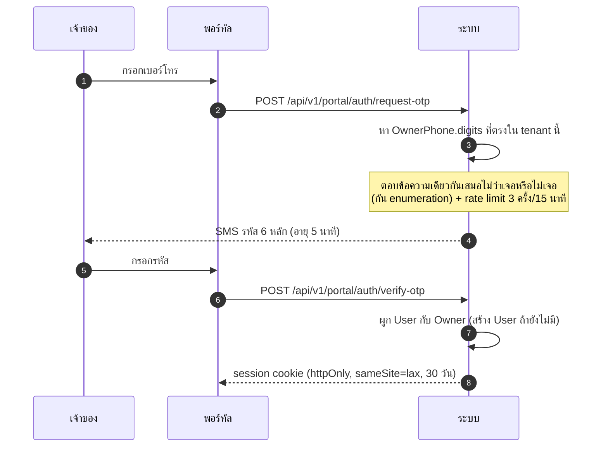
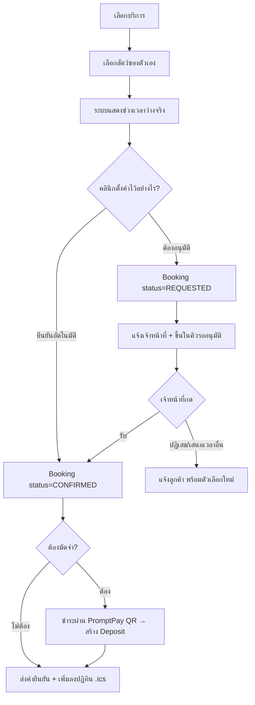
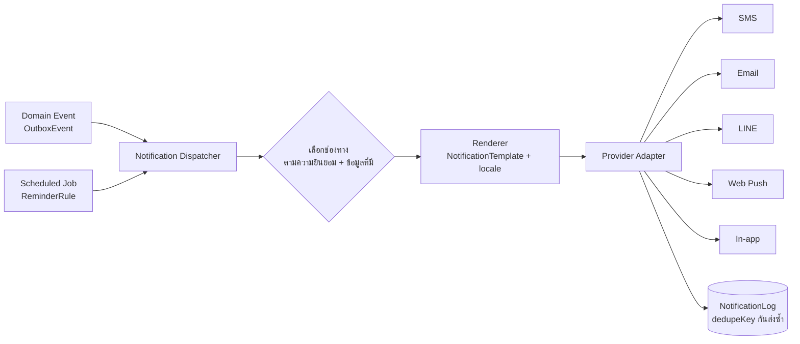

# 07 — พอร์ทัลเจ้าของสัตว์ และระบบแจ้งเตือน

## 1. พอร์ทัลลูกค้า — ขอบเขต

พอร์ทัลเป็น PWA แยก route group `(portal)` มี auth คนละชุดกับแอปพนักงาน
ใช้โดเมนย่อยเดียวกับคลินิก (`clinicA.petcare.app/me`) เพื่อให้ลูกค้ารู้ว่ากำลังคุยกับคลินิกไหน

| ทำได้ | ทำไม่ได้ (โดยตั้งใจ) |
| --- | --- |
| ดูข้อมูลสัตว์ของตัวเอง + แก้ข้อมูลติดต่อ | แก้ข้อมูลทางคลินิก (น้ำหนัก, การวินิจฉัย) |
| ดูประวัติวัคซีน + ดาวน์โหลดใบรับรอง | ดู SOAP note ฉบับเต็ม (ดูได้เฉพาะ *สรุปการรักษา* ที่หมออนุมัติให้เผยแพร่) |
| จองนัดตรวจ / อาบน้ำตัดขน / ห้องฝาก | เลือกหมอเฉพาะเจาะจงในบางคลินิก (ตั้งค่าได้) |
| ดูใบเสร็จย้อนหลัง + ยอดค้างชำระ | ดูราคาต้นทุน, ดูข้อมูลสัตว์ตัวอื่น |
| ดูอัปเดตสัตว์ที่ฝากเลี้ยง (รูป + บันทึกดูแล) | ดูบันทึกภายในของเจ้าหน้าที่ (`internalNote`) |
| อัปโหลดรูป/วิดีโออาการเบื้องต้น | เข้าถึงข้อมูลลูกค้ารายอื่นทุกกรณี |
| จัดการความยินยอม PDPA | |

## 2. การยืนยันตัวตนของเจ้าของ

เจ้าของสัตว์ล็อกอินด้วย **OTP เบอร์โทรศัพท์** ไม่ใช่รหัสผ่าน เพราะ:
- เบอร์โทรคือสิ่งที่คลินิกมีอยู่แล้วในระบบ (ไม่ต้องกรอกซ้ำ)
- ลูกค้ากลุ่มนี้ลืมรหัสผ่านสูงมาก และการรีเซ็ตรหัสผ่านทางอีเมลมักไม่มีอีเมลในระบบ



**ความปลอดภัยที่ต้องมี:** ล็อกหลังใส่ผิด 5 ครั้ง, OTP ใช้ได้ครั้งเดียว, ผูก session กับ
`tenantId` เสมอ — เจ้าของที่ใช้บริการหลายคลินิกต้องล็อกอินแยกต่อคลินิก (ข้อมูลไม่ปนกัน)

## 3. การจองออนไลน์ (US-18)

### 3.1 ขั้นตอน



### 3.2 การคำนวณช่วงเวลาว่าง

```ts
// modules/scheduling/get-availability.ts
export async function getAvailability(ctx, input: {
  branchId: string; serviceItemId: string; date: Date; petId: string;
}): Promise<Slot[]> {
  const service = await getServiceItem(ctx, input.serviceItemId);
  if (!service.isBookableOnline) throw new ForbiddenError('บริการนี้ไม่เปิดให้จองออนไลน์');

  const resources = await findResourcesByType(ctx, input.branchId, service.requiredResourceType);
  const slots: Slot[] = [];

  for (const r of resources) {
    const shifts = await getShiftsForDate(ctx, r.id, input.date);      // เวลาทำงาน
    const busy = await getBusyRanges(ctx, r.id, input.date);           // BookingResource + Stay + TimeOff
    for (const shift of shifts) {
      for (const start of stepThrough(shift, service.durationMinutes, shift.slotMinutes)) {
        const end = addMinutes(start, service.durationMinutes);
        if (overlapsAny(start, end, busy)) continue;
        if (start < addHours(now(), ctx.policy.minLeadTimeHours)) continue;  // กันจองกระชั้น
        slots.push({ start, end, resourceId: r.id });
      }
    }
  }
  return dedupeByStartTime(slots);   // ลูกค้าเห็นแค่ "ว่าง/ไม่ว่าง" ไม่เห็นว่าหมอคนไหนว่าง
}
```

**การกันจองชนกัน:** ช่วงเวลาที่แสดงเป็นเพียงการคาดการณ์ การยืนยันจริงเกิดในทรานแซกชัน
ที่ `INSERT BookingResource` แล้วให้ `EXCLUDE USING gist` ตัดสิน ถ้าชนจะได้ error
ที่ระบบแปลเป็นข้อความ "ช่วงเวลานี้เพิ่งถูกจองไป กรุณาเลือกเวลาอื่น" พร้อมรีเฟรชตัวเลือก

### 3.3 นโยบายการจองที่ตั้งค่าได้

| นโยบาย | ค่าเริ่มต้น |
| --- | --- |
| จองล่วงหน้าอย่างน้อย | 2 ชั่วโมง |
| จองล่วงหน้าได้ไกลสุด | 60 วัน |
| ยืนยันอัตโนมัติ | เปิดสำหรับกรูมมิ่ง, ปิดสำหรับตรวจรักษาและห้องฝาก |
| ลูกค้าใหม่ (ยังไม่เคยมา) จองออนไลน์ได้ | ปิด — ต้องโทรมาก่อน |
| ยกเลิกเองได้ถึงเมื่อไร | ก่อนถึงเวลานัด 24 ชั่วโมง |
| จำกัดจำนวนการจองค้างต่อลูกค้า | 3 รายการ |
| ลูกค้าที่เคย no-show 2 ครั้ง | ต้องให้เจ้าหน้าที่อนุมัติ |

## 4. หน้าติดตามสัตว์ที่ฝากเลี้ยง

หน้าที่ลูกค้าเปิดบ่อยที่สุดระหว่างเดินทาง — แสดงเป็นไทม์ไลน์:

```
🐕 ข้าวปุ้น — วันที่ 2 จาก 5   [กรง D-01 โซนสุนัข]

วันนี้ 17 ก.ย.
 18:30  🍖 อาหารเย็น — กินหมด        [รูป]
 16:00  🚶 พาเดินเล่น 20 นาที         [รูป]
 12:00  💊 ให้ยา Amoxicillin 1 เม็ด
 08:15  🍖 อาหารเช้า — กินหมด
 07:30  😊 อารมณ์ดี ร่าเริง

[ ส่งข้อความถึงคลินิก ]   [ ขอเพิ่มบริการอาบน้ำ ]
```

เฉพาะ `CareLog` ที่เจ้าหน้าที่กด "แชร์ให้เจ้าของ" เท่านั้นที่ปรากฏ (ตั้งค่าให้แชร์
อัตโนมัติตามประเภทได้) ส่วนบันทึกทางคลินิกที่ละเอียดอ่อนไม่แชร์โดยอัตโนมัติ

ปุ่ม "ขอเพิ่มบริการ" สร้าง `Booking` ประเภท `GROOMING` ที่ผูกกับ `Stay` ปัจจุบัน
ค่าใช้จ่ายไปรวมที่บิลเดียวกันตอนเช็คเอาท์

## 5. ระบบแจ้งเตือน

### 5.1 สถาปัตยกรรม



**Provider เป็น adapter หลัง interface เดียว** — ตอนนี้ยังไม่ต่อ LINE แต่โครงพร้อมแล้ว
เพิ่มภายหลังโดยเขียน adapter ตัวเดียว ไม่ต้องแก้ตรรกะธุรกิจ

```ts
// modules/notification/channel.ts
export interface NotificationChannelAdapter {
  readonly channel: NotificationChannel;
  canReach(owner: OwnerContactInfo): boolean;
  send(msg: RenderedMessage): Promise<{ providerRef?: string }>;
}
```

### 5.2 การแจ้งเตือนที่ต้องมี

| เหตุการณ์ | เวลาส่ง | ช่องทางที่แนะนำ |
| --- | --- | --- |
| ยืนยันการจอง | ทันที | SMS + อีเมล |
| เตือนนัดล่วงหน้า | ก่อน 1 วัน เวลา 09:00 | SMS |
| เตือนนัดอีกครั้ง | ก่อน 2 ชั่วโมง | Push / LINE |
| วัคซีนครบกำหนด | ก่อน 7 วัน และวันครบกำหนด | SMS + อีเมล |
| ยาใกล้หมด (โรคเรื้อรัง) | ก่อนยาหมด 5 วัน | SMS |
| ถึงรอบอาบน้ำตัดขน | ตาม `nextDueWeeks` | LINE / อีเมล |
| อัปเดตสัตว์ที่ฝาก | ทุกครั้งที่แชร์ care log | Push (ถ้าเปิดแอป) |
| สัตว์อาบน้ำเสร็จ พร้อมรับ | ทันที | SMS + รูปหลังตัด |
| สรุปการรักษาหลังปิดเคส | ทันทีหลังชำระเงิน | อีเมล + พอร์ทัล |
| ยอดค้างชำระ | ทุก 7 วัน สูงสุด 3 ครั้ง | SMS |
| ผลแล็บออกแล้ว | เมื่อหมออนุมัติให้เผยแพร่ | พอร์ทัล + SMS แจ้งให้เข้าดู |

### 5.3 กฎการส่งที่ต้องบังคับ

1. **เคารพความยินยอม** — การแจ้งเตือนเชิงบริการ (นัด, ผลตรวจ) ส่งได้ตามสัญญา
   แต่การตลาด (โปรโมชัน) ต้องมี `OwnerConsent(MARKETING)` ที่ยัง active
2. **กันส่งซ้ำด้วย `dedupeKey`** เช่น `vaccine-due:{petId}:{dueDate}` มี unique index
   ต่อ tenant — งานรันซ้ำกี่รอบก็ส่งครั้งเดียว
3. **เวลาห้ามรบกวน** — ไม่ส่ง SMS/Push ระหว่าง 21:00–08:00 ยกเว้นเรื่องฉุกเฉินทางคลินิก
   (เลื่อนไปส่งเช้าวันถัดไป)
4. **รวมข้อความ** — เจ้าของที่มีสัตว์ 3 ตัวครบกำหนดวัคซีนวันเดียวกัน ได้ข้อความเดียว
5. **ทุกข้อความมีวิธีเลิกรับ** สำหรับประเภทที่เลิกรับได้
6. **บันทึกทุกครั้งลง `NotificationLog`** รวมถึงที่ส่งไม่สำเร็จ — เมื่อลูกค้าบอกว่า
   "ไม่ได้รับ SMS แจ้งนัด" ต้องตรวจสอบได้

### 5.4 ตัวอย่างเทมเพลต

```
[APPOINTMENT_REMINDER / SMS / th]
{{clinicName}}: แจ้งเตือนนัด {{petName}} วัน{{thaiDate}} เวลา {{time}} น.
{{#if vetName}}กับ {{vetName}} {{/if}}โทร {{clinicPhone}} หากต้องการเลื่อนนัด

[VACCINE_DUE / SMS / th]
{{clinicName}}: {{petName}} ถึงกำหนดฉีด{{vaccineName}}แล้ว ({{dueDateThai}})
จองคิวได้ที่ {{shortLink}} หรือโทร {{clinicPhone}}

[GROOMING_READY / SMS / th]
{{petName}} อาบน้ำตัดขนเสร็จเรียบร้อยแล้วค่ะ สวยมาก 🐩
มารับได้ถึง {{closingTime}} น. — {{clinicName}}
```

SMS ภาษาไทยคิดเป็น 70 ตัวอักษรต่อข้อความ (Unicode) ระบบต้อง **แสดงจำนวนข้อความและ
ค่าใช้จ่ายโดยประมาณ** ตอนที่ผู้ดูแลแก้เทมเพลต — ไม่งั้นค่า SMS บานปลายโดยไม่รู้ตัว
