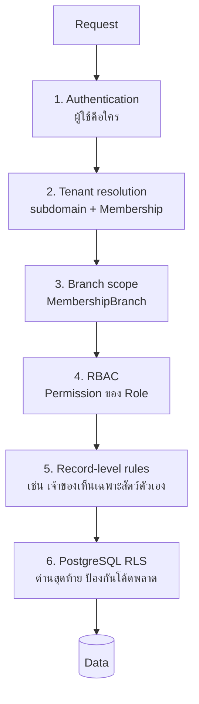

# 08 — สิทธิ์การใช้งาน, การตรวจสอบ และ PDPA

## 1. ชั้นของการควบคุมการเข้าถึง



ชั้น 6 มีไว้เพราะชั้น 1–5 เป็นโค้ดที่คนเขียน และคนลืมใส่ `where tenantId` ได้เสมอ
RLS ทำให้ความผิดพลาดนั้นไม่กลายเป็นข้อมูลรั่วข้ามคลินิก

## 2. บทบาทและสิทธิ์

### 2.1 สิทธิ์ (Permission)

ตั้งชื่อแบบ `<โดเมน>:<การกระทำ>` เก็บในตาราง `Permission` ประกอบเป็น `Role` ที่คลินิกแก้ได้

| กลุ่ม | ตัวอย่างสิทธิ์ |
| --- | --- |
| `patient` | `patient:read`, `patient:write`, `patient:merge`, `patient:delete` |
| `clinical` | `clinical:read`, `clinical:write`, `clinical:sign`, `clinical:addendum`, `clinical:override_alert` |
| `pharmacy` | `pharmacy:prescribe`, `pharmacy:dispense`, `pharmacy:controlled_drug` |
| `scheduling` | `scheduling:read`, `scheduling:write`, `scheduling:override_conflict` |
| `boarding` | `boarding:checkin`, `boarding:checkout`, `boarding:care_log`, `boarding:waive_vaccine` |
| `grooming` | `grooming:read`, `grooming:write` |
| `inventory` | `inventory:read`, `inventory:receive`, `inventory:adjust`, `inventory:count_approve`, `inventory:purchase_approve` |
| `billing` | `billing:read`, `billing:charge`, `billing:invoice`, `billing:approve_discount`, `billing:void_invoice`, `billing:credit_note`, `billing:refund` |
| `cash` | `cash:open_shift`, `cash:close_shift`, `cash:approve_variance` |
| `report` | `report:branch`, `report:tenant`, `report:financial`, `report:export` |
| `admin` | `admin:users`, `admin:roles`, `admin:catalog`, `admin:settings`, `admin:tax_profile` |

### 2.2 บทบาทสำเร็จรูป

| บทบาท | ได้อะไร | ที่ไม่ได้ (สำคัญ) |
| --- | --- | --- |
| `RECEPTIONIST` | ทะเบียนลูกค้า, นัดหมาย, เช็คอิน, ออกบิล, รับเงิน | อ่าน/แก้เวชระเบียน, ยกเลิกบิล, ให้ส่วนลดเกินเพดาน |
| `VET_TECH` | อ่านเวชระเบียน, บันทึก vital, MAR, จ่ายยา, care log | ลงนาม SOAP, สั่งยา, ยาควบคุม |
| `VET` | ทุกอย่างทางคลินิก, สั่งยา, ลงนาม, ยาควบคุม | แก้ราคา, ยกเลิกบิล, จัดการผู้ใช้ |
| `GROOMER` | คิวกรูมมิ่งของตัวเอง, บันทึกงาน, อัปโหลดรูป | เวชระเบียน, การเงิน |
| `BOARDING_STAFF` | ผังกรง, เช็คอิน-เอาท์, care log | เวชระเบียนเต็ม, การเงิน |
| `PHARMACY` | คลังทั้งหมด, จ่ายยา, ทะเบียนยาควบคุม | เวชระเบียน (อ่านได้เฉพาะส่วนที่จำเป็นต่อการจ่ายยา) |
| `CASHIER` | ออกบิล, รับเงิน, เปิด-ปิดกะ | ยกเลิกบิล, ใบลดหนี้ |
| `BRANCH_MANAGER` | ทุกอย่างในสาขาตัวเอง + อนุมัติส่วนลด/ผลต่างเงินสด + รายงานสาขา | ข้ามสาขา, ตั้งค่าภาษี |
| `OWNER_ADMIN` | ทุกอย่างทุกสาขา, ตั้งค่าระบบ, จัดการผู้ใช้ | — |
| `PET_OWNER` | เฉพาะข้อมูลของตัวเองผ่านพอร์ทัล | ทุกอย่างในแอปพนักงาน |

### 2.3 การบังคับใช้ในโค้ด

```ts
// server/policy/ability.ts
export function buildAbility(actor: Actor) {
  return {
    can(permission: PermissionKey, resource?: Resource) {
      if (!actor.permissions.has(permission)) return false;
      if (resource?.branchId && !actor.branchIds.has(resource.branchId)
          && !actor.permissions.has('report:tenant')) return false;
      return true;
    },
    assert(permission: PermissionKey, resource?: Resource) {
      if (!this.can(permission, resource)) {
        throw new ForbiddenError(`ไม่มีสิทธิ์: ${permission}`);
      }
    },
  };
}
```

ทุก use-case เริ่มด้วย `ctx.can('...')` เสมอ — บังคับด้วย ESLint rule ที่ตรวจว่า
ฟังก์ชันที่ export จาก `modules/*/` ซึ่งรับ `ctx` ต้องเรียก `ctx.can` อย่างน้อยหนึ่งครั้ง

### 2.4 Break-glass — การเข้าถึงฉุกเฉิน

กรณีสัตว์ถูกส่งมาฉุกเฉินนอกเวลา และคนที่อยู่ไม่มีสิทธิ์ที่ต้องใช้ ระบบมีปุ่ม
**"เข้าถึงกรณีฉุกเฉิน"** ที่ให้สิทธิ์ชั่วคราว 60 นาที โดยต้องระบุเหตุผล → บันทึกลง
`AuditLog` ระดับสูงสุด และแจ้งผู้จัดการทันที ปิดกั้นดีกว่าคือให้เข้าถึงได้แต่ตรวจสอบได้
เพราะการบล็อกในภาวะฉุกเฉินอาจทำให้สัตว์เสียชีวิต

## 3. การตรวจสอบย้อนหลัง (Audit)

### 3.1 สิ่งที่ต้องบันทึกเสมอ

| หมวด | เหตุการณ์ |
| --- | --- |
| เวชระเบียน | สร้าง/แก้/ลงนาม/addendum, ดูเวชระเบียนของสัตว์ (read audit สำหรับ role ที่ไม่ใช่หมอเจ้าของเคส) |
| ยา | สั่ง, จ่าย, ยกเลิก, ข้ามคำเตือนแพ้ยา, ทุกรายการยาควบคุม |
| การเงิน | ออกบิล, ยกเลิกบิล, ใบลดหนี้, ส่วนลดเกินเพดาน, คืนเงิน, พิมพ์บิลซ้ำ, ปิดกะที่มีผลต่าง |
| สต็อก | ปรับยอด, ผลต่างการตรวจนับ, ลงของเสีย |
| สิทธิ์ | เพิ่ม/ลบผู้ใช้, เปลี่ยนบทบาท, break-glass, ล็อกอินล้มเหลวเกินเกณฑ์ |
| ข้อมูลส่วนบุคคล | ส่งออกข้อมูล, ลบข้อมูล, เปลี่ยนความยินยอม |

### 3.2 การบังคับ append-only

```sql
CREATE OR REPLACE FUNCTION forbid_mutation() RETURNS trigger AS $$
BEGIN
  RAISE EXCEPTION 'ตาราง % เป็น append-only ห้าม % ', TG_TABLE_NAME, TG_OP;
END $$ LANGUAGE plpgsql;

CREATE TRIGGER audit_log_immutable
  BEFORE UPDATE OR DELETE ON "AuditLog"
  FOR EACH ROW EXECUTE FUNCTION forbid_mutation();

CREATE TRIGGER stock_movement_immutable
  BEFORE UPDATE OR DELETE ON "StockMovement"
  FOR EACH ROW EXECUTE FUNCTION forbid_mutation();
```

ใช้กติกาเดียวกันกับ `InvoiceLine` และ `Payment` (ยกเว้นการตั้ง `voidedAt` ซึ่งอนุญาต
เฉพาะฟิลด์นั้นผ่าน trigger ที่ตรวจว่าฟิลด์อื่นไม่เปลี่ยน)

### 3.3 เวชระเบียนที่ลงนามแล้ว

```sql
CREATE OR REPLACE FUNCTION protect_signed_soap() RETURNS trigger AS $$
BEGIN
  IF OLD.signed_at IS NOT NULL AND (
       NEW.subjective IS DISTINCT FROM OLD.subjective OR
       NEW.objective  IS DISTINCT FROM OLD.objective  OR
       NEW.assessment IS DISTINCT FROM OLD.assessment OR
       NEW.plan       IS DISTINCT FROM OLD.plan)
  THEN
    RAISE EXCEPTION 'เวชระเบียนที่ลงนามแล้วแก้ไขไม่ได้ ให้ใช้ addendum';
  END IF;
  RETURN NEW;
END $$ LANGUAGE plpgsql;
```

## 4. ความปลอดภัยของระบบ

| ด้าน | มาตรการ |
| --- | --- |
| รหัสผ่าน | Argon2id, ขั้นต่ำ 12 ตัวอักษร, ตรวจกับรายการรหัสผ่านที่รั่วไหล |
| MFA | บังคับ TOTP สำหรับ `BRANCH_MANAGER` ขึ้นไป และทุก role ที่มีสิทธิ์ `billing:void_invoice` |
| Session | httpOnly + secure + sameSite, หมดอายุ 12 ชม.สำหรับพนักงาน / 30 วันสำหรับเจ้าของสัตว์, เพิกถอนได้จากหน้าจัดการ |
| Rate limit | ล็อกอิน 5 ครั้ง/15 นาที/บัญชี, OTP 3 ครั้ง/15 นาที/เบอร์, API ทั่วไป 100 req/นาที/tenant |
| ไฟล์ | S3 private ทั้งหมด, เข้าถึงผ่าน presigned URL อายุ 5 นาทีที่ออกหลังตรวจสิทธิ์แล้วเท่านั้น |
| ข้อมูลอ่อนไหวในฐานข้อมูล | เลขบัตรประชาชน, MFA secret เข้ารหัสด้วย AES-256-GCM ที่ชั้นแอป (คีย์อยู่ใน KMS ไม่ใช่ใน DB) |
| การเชื่อมต่อ | TLS 1.3 ทุกช่องทาง, HSTS, DB บังคับ SSL |
| Secrets | ไม่มี secret ในโค้ด — ผ่าน environment/KMS, หมุนคีย์ทุก 90 วัน |
| Dependency | `npm audit` + Dependabot ใน CI, บล็อก build เมื่อพบช่องโหว่ระดับสูง |
| Backup | เข้ารหัสขณะพัก, ทดสอบกู้คืนทุกไตรมาส, สำเนานอกภูมิภาค |
| การเข้าถึงของทีมพัฒนา | ห้ามเข้าถึง production DB โดยตรง; ต้องผ่าน break-glass ที่บันทึก audit และมีผู้อนุมัติ |

### 4.1 การทดสอบ RLS

ต้องมีเทสที่รันกับ PostgreSQL จริง (testcontainers) ไม่ใช่ mock:

```ts
// modules/identity/__tests__/rls.test.ts
it('อ่านข้อมูลข้าม tenant ไม่ได้แม้จะ query ตรง ๆ', async () => {
  const a = await seedTenant('clinic-a');
  const b = await seedTenant('clinic-b');
  const petOfB = await createPet(b, { name: 'เหมียว' });

  const client = forTenant(a.id);
  const found = await client.pet.findUnique({ where: { id: petOfB.id } });

  expect(found).toBeNull();            // RLS กรองออก แม้จะรู้ id
});

it('เขียนข้อมูลให้ tenant อื่นไม่ได้', async () => {
  const client = forTenant(a.id);
  await expect(
    client.pet.create({ data: { tenantId: b.id, /* ... */ } }),
  ).rejects.toThrow(/row-level security/);
});
```

เทสชุดนี้ต้องรันทุก PR และครอบคลุมทุกตารางที่มี `tenantId` — สคริปต์ตรวจอัตโนมัติว่า
ตารางใหม่ที่เพิ่มเข้ามามี policy แล้วหรือยัง ถ้ายังให้ CI แดง

## 5. PDPA — พ.ร.บ.คุ้มครองข้อมูลส่วนบุคคล

> เอกสารนี้อธิบายกลไกที่ระบบเตรียมไว้ ไม่ใช่คำแนะนำทางกฎหมาย
> คลินิกควรให้ที่ปรึกษากฎหมายตรวจนโยบายและข้อความคำยินยอมก่อนใช้จริง

### 5.1 ข้อมูลส่วนบุคคลที่ระบบเก็บ

| ข้อมูล | ฐานทางกฎหมายที่มักใช้ | หมายเหตุ |
| --- | --- | --- |
| ชื่อ, เบอร์โทร, ที่อยู่ เจ้าของ | การปฏิบัติตามสัญญา | จำเป็นต่อการให้บริการ |
| เลขประจำตัวผู้เสียภาษี, ที่อยู่ออกใบกำกับ | หน้าที่ตามกฎหมาย | เก็บตามอายุความภาษี 5 ปี |
| เลขบัตรประชาชน | เฉพาะเมื่อจำเป็น เช่น การุณยฆาต | เข้ารหัส + จำกัดสิทธิ์เข้าถึง |
| รูปถ่าย/วิดีโอสัตว์ | ความยินยอม (ถ้าจะเผยแพร่) | แยก consent `PHOTO_SHARING` |
| ข้อมูลการตลาด | ความยินยอม | ถอนได้ทุกเมื่อ |

*ข้อมูลสัตว์เลี้ยงเองไม่ใช่ข้อมูลส่วนบุคคล แต่เชื่อมโยงกลับไปหาเจ้าของได้
จึงถือเป็นข้อมูลส่วนบุคคลโดยอ้อมและปฏิบัติด้วยมาตรฐานเดียวกัน*

### 5.2 สิทธิของเจ้าของข้อมูลและการรองรับ

| สิทธิ | ระบบทำอะไร |
| --- | --- |
| ขอเข้าถึง / ขอสำเนา | ปุ่ม "ดาวน์โหลดข้อมูลของฉัน" ในพอร์ทัล → สร้างไฟล์ ZIP (JSON + PDF เวชระเบียน) ภายใน 30 วัน |
| ขอแก้ไข | แก้ข้อมูลติดต่อเองได้; ข้อมูลทางคลินิกยื่นคำขอให้คลินิกพิจารณา (ห้ามแก้ประวัติการรักษาย้อนหลัง) |
| ขอลบ | ดูข้อ 5.3 |
| ขอถอนความยินยอม | ปิดสวิตช์ในพอร์ทัล → `OwnerConsent.revokedAt` มีผลทันทีกับการส่งข้อความการตลาด |
| ขอให้ระงับใช้ | ตั้งสถานะ `processingRestricted` → ระบบหยุดส่งข้อความทุกประเภทที่ไม่บังคับ |
| คัดค้านการประมวลผล | บันทึกคำคัดค้าน + แจ้งผู้ควบคุมข้อมูลของคลินิก |

### 5.3 การลบข้อมูล — ทำไมไม่ลบจริง

คำขอลบชนกับหน้าที่ตามกฎหมายสองข้อ: เอกสารภาษีต้องเก็บ 5 ปี และเวชระเบียนเป็นหลักฐาน
ทางวิชาชีพ ระบบจึงใช้ **pseudonymization** แทนการลบ:

```
Owner.firstName  "แพร"           → "ผู้ใช้ที่ขอลบข้อมูล #4821"
Owner.lastName   "สุขใจ"          → null
OwnerPhone       "0812345678"    → ลบทั้งแถว
Owner.email      "prae@..."      → null
Owner.addressLine "123 ซอย..."   → null
Owner.idCardNoEnc                → ลบ
Invoice.buyerName "แพร สุขใจ"     → คงไว้ (หน้าที่ตามกฎหมายภาษี)
Pet / Encounter / SoapNote       → คงไว้ แต่ตัดการเชื่อมโยงกลับหาบุคคล
```

ระบบต้อง:
1. บันทึกคำขอ วันที่ ผู้อนุมัติ และขอบเขตที่ทำได้/ทำไม่ได้ พร้อมเหตุผลที่แจ้งลูกค้า
2. รันเป็นงานเดียวในทรานแซกชันเดียว มีรายงานยืนยันสิ่งที่ถูกเปลี่ยน
3. ลบจาก backup ไม่ได้ทันที — ต้องระบุในนโยบายว่าข้อมูลจะหายจาก backup
   ภายในระยะเวลาเก็บ backup (30 วัน)

### 5.4 อื่น ๆ ที่ต้องมี

- **บันทึกรายการกิจกรรมการประมวลผล (RoPA)** — เอกสารประกอบ ไม่ใช่ฟีเจอร์ในระบบ
- **ข้อตกลงกับผู้ประมวลผลข้อมูล (DPA)** กับผู้ให้บริการ cloud, SMS, e-Tax ทุกราย
- **แจ้งเหตุละเมิดข้อมูลภายใน 72 ชั่วโมง** — ต้องมี runbook และช่องทางแจ้งเตือนที่ซ้อมแล้ว
- **เก็บข้อมูลในประเทศไทยหรือประเทศที่มีมาตรฐานคุ้มครองเพียงพอ** — เลือก region
  `ap-southeast-1` (สิงคโปร์) หรือ region ไทย และระบุในนโยบายความเป็นส่วนตัว
- **ข้อความคำยินยอมต้องเก็บเป็นเวอร์ชัน** (`OwnerConsent.version` + `bodySnapshot`)
  เพื่อพิสูจน์ได้ว่าลูกค้าเห็นข้อความแบบไหนตอนกดยินยอม
