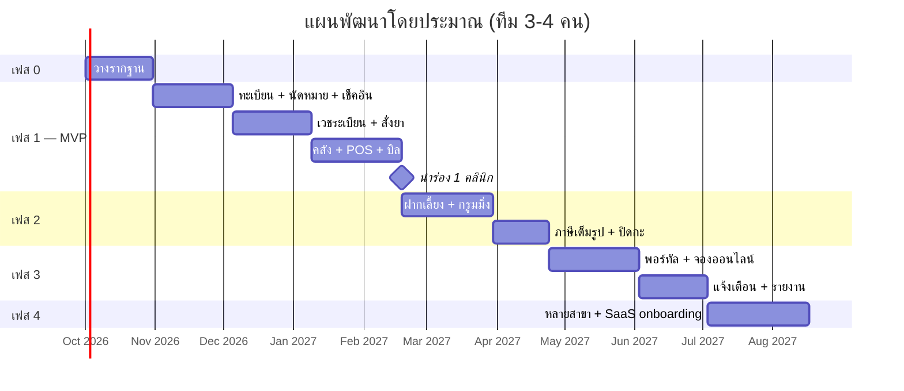

# 10 — แผนพัฒนา ความเสี่ยง และเกณฑ์ความสำเร็จ

## 1. หลักการจัดลำดับ

เรียงตาม **ลำดับที่คลินิกจริงจะเริ่มใช้งานได้** ไม่ใช่ตามความง่ายทางเทคนิค
คลินิกเปลี่ยนระบบทีเดียวทั้งหมดไม่ได้ — ต้องเริ่มจากงานหน้าเคาน์เตอร์ที่ใช้ทุกวัน
แล้วค่อยขยาย เพราะถ้าโมดูลแรกไม่ถูกใช้จริง โมดูลที่เหลือก็ไม่มีความหมาย

## 2. เฟส 0 — วางรากฐาน (ประมาณ 4 สัปดาห์)

สิ่งที่ต้องเสร็จก่อนเขียนฟีเจอร์แรก เพราะแก้ทีหลังแพงมาก:

- [ ] โครงโปรเจกต์ Next.js + TypeScript strict + ESLint rule บังคับขอบเขตโมดูล
- [ ] Prisma schema เฟสแรก + **RLS ครบทุกตาราง** + เทส RLS ที่รันกับ Postgres จริง
- [ ] `AppContext` (tenant, branch, actor, tx, can, emit) และ tenant client extension
- [ ] Auth.js สองเส้นทาง (staff / owner) + RBAC + seed บทบาทสำเร็จรูป
- [ ] `AuditLog` + `OutboxEvent` + worker พื้นฐาน
- [ ] ชุดยูทิลิตี้: เงินสตางค์, วันที่ พ.ศ., `bahtText()`, `DocumentSequence`
- [ ] CI: typecheck, lint, unit, integration (testcontainers), ตรวจ RLS coverage
- [ ] docker compose สำหรับ dev (postgres + redis + minio + mailhog)

**เกณฑ์ผ่าน:** เทส "อ่านข้อมูลข้าม tenant ไม่ได้" ผ่าน และมีสคริปต์ตรวจใน CI ว่า
ตารางใหม่ที่ไม่มี RLS policy ทำให้ build แดง

## 3. เฟส 1 — MVP ที่คลินิกใช้แทนกระดาษได้ (ประมาณ 4 เดือน)

| ชุดงาน | ขอบเขต |
| --- | --- |
| ทะเบียน | เจ้าของ, สัตว์, ค้นหาภาษาไทย, แจ้งเตือนแพ้ยา, ประวัติน้ำหนัก |
| นัดหมาย | ปฏิทินทรัพยากร, จองโดยเจ้าหน้าที่, กันจองซ้อน, เช็คอิน |
| Whiteboard | คิวเรียลไทม์ผ่าน SSE |
| เวชระเบียน | vital, SOAP + ลงนาม + addendum, คำสั่ง lab, แนบไฟล์, วัคซีน + ใบรับรอง |
| เภสัช | สั่งยา + คำนวณขนาดตามน้ำหนัก, จ่ายยา FEFO, ฉลากยาไทย |
| คลัง (พื้นฐาน) | สินค้า, หน่วยนับ, ล็อต/วันหมดอายุ, รับของ, ปรับยอด, ตรวจนับ |
| POS + บิล | ขายหน้าร้าน, `ChargeItem` รวมทุกต้นทาง, ใบเสร็จรับเงิน, รับชำระหลายวิธี |

**ยังไม่ทำในเฟสนี้:** ฝากเลี้ยง, กรูมมิ่ง, พอร์ทัล, ใบกำกับภาษีเต็มรูป, หลายสาขา

**เกณฑ์ผ่าน (Definition of Done ระดับเฟส):**
1. คลินิกนำร่อง 1 แห่งใช้งานจริงได้ตลอดวันทำการโดยไม่ต้องกลับไปใช้กระดาษ
2. เปิดเคสใหม่จาก walk-in ได้ภายใน 60 วินาที (จับเวลาจริงกับผู้ใช้จริง)
3. สั่งยา → จ่ายยา → ตัดสต็อก → ขึ้นบิล ครบวงจรโดยไม่มีขั้นตอนที่ต้องทำมือ
4. ยอดสต็อกจากระบบตรงกับการนับจริง ≥ 98% หลังใช้งาน 1 เดือน
5. ไม่มีเหตุการณ์ข้อมูลรั่วข้าม tenant ในการทดสอบเจาะระบบ

## 4. เฟส 2 — ฝากเลี้ยง, กรูมมิ่ง และภาษีเต็มรูป (ประมาณ 3 เดือน)

- ผังกรง + จอง/เช็คอิน/เช็คเอาท์ + care log + คิดค่าห้องรายวันแบบ idempotent
- ตรวจวัคซีนก่อนรับฝาก + ของฝากติดตัว + ใบยินยอม
- คิวกรูมมิ่ง + การ์ดประจำตัวสัตว์ + รูปก่อน-หลัง + ส่งต่อให้หมอ
- ผู้ป่วยใน + MAR
- ใบกำกับภาษีเต็มรูป/อย่างย่อ, ใบลดหนี้, ปิดกะเงินสด, รายงานภาษีขาย
- ยาควบคุม + ทะเบียน

**เกณฑ์ผ่าน:** ผู้ทำบัญชีของคลินิกนำร่องตรวจเอกสารภาษี 1 เดือนเต็มแล้วยืนยันว่าใช้ได้
และกรณีทดสอบทั้ง 10 ข้อในเอกสาร [06](06-billing-pos-and-tax.md#9) ผ่านทั้งหมด

## 5. เฟส 3 — พอร์ทัลและการสื่อสาร (ประมาณ 2.5 เดือน)

- พอร์ทัลเจ้าของ: OTP เบอร์โทร, ดูข้อมูลสัตว์, ใบเสร็จ, ใบรับรองวัคซีน
- จองออนไลน์ + นโยบายการจอง + มัดจำผ่าน PromptPay
- ติดตามสัตว์ที่ฝากเลี้ยงแบบไทม์ไลน์
- แจ้งเตือน SMS/อีเมล + reminder engine + กันส่งซ้ำ
- รายงานผู้บริหารชุดแรก

**เกณฑ์ผ่าน:** ≥ 30% ของการจองกรูมมิ่งมาจากพอร์ทัล และสายโทรเข้าถามสถานะ
สัตว์ที่ฝากลดลงอย่างมีนัยสำคัญ (วัดจากคลินิกนำร่อง)

## 6. เฟส 4 — ขยายเป็น SaaS หลายคลินิก (ประมาณ 3 เดือน)

- หลายสาขาเต็มรูปแบบ: โอนสต็อกระหว่างสาขา, รายงานรวม, สิทธิ์ตามสาขา
- Onboarding คลินิกใหม่แบบ self-service + นำเข้าข้อมูลจากระบบเดิม (Excel/CSV)
- แพ็กเกจ + เรียกเก็บค่าบริการรายเดือน + feature flag
- แอดมินแพลตฟอร์ม + เครื่องมือสนับสนุนลูกค้า
- LINE Messaging API
- ส่งออกไฟล์ให้โปรแกรมบัญชียอดนิยมในไทย

## 7. งานที่รอไว้อย่างจงใจ (Backlog)

| งาน | เหตุผลที่ยังไม่ทำ |
| --- | --- |
| เชื่อมเครื่อง lab (ASTM/HL7) | ต้องมีเครื่องจริงมาทดสอบ และแต่ละยี่ห้อต่างกัน |
| DICOM viewer | ซับซ้อนสูง คลินิกส่วนใหญ่ใช้ซอฟต์แวร์ของเครื่องอยู่แล้ว |
| e-Tax Invoice | รอจนมีคลินิกที่จด VAT จำนวนพอที่จะคุ้มค่าเชื่อมต่อ |
| ยาผสมเอง (compounding) | ต้องออกแบบ BOM และการตัดวัตถุดิบ |
| ระบบสมาชิก/แต้มสะสม | ชัดเจนว่าอยากได้ แต่ไม่ใช่สิ่งที่ทำให้คลินิกเปลี่ยนระบบ |
| แอปมือถือ native | PWA เพียงพอสำหรับพฤติกรรมผู้ใช้ปัจจุบัน |
| โหมดออฟไลน์ของ POS | ซับซ้อนสูง (ต้อง sync + แก้ conflict) รอดูว่าปัญหาจริงแค่ไหน |
| หลายภาษาเต็มรูปแบบ | โครง i18n มีแล้ว แต่ยังแปลแค่ไทย/อังกฤษ |

## 8. ความเสี่ยงและการรับมือ

| ความเสี่ยง | ผลกระทบ | การรับมือ |
| --- | --- | --- |
| **การจัดประเภทภาษีของบริการสัตวแพทย์ตีความผิด** | ออกเอกสารผิดทั้งระบบ ย้อนหลังแก้ยาก | ทำให้ `taxCode` ตั้งค่าได้รายรายการตั้งแต่ต้น + ให้ผู้ทำบัญชีของคลินิกยืนยันก่อน go-live |
| **หมอไม่ยอมใช้ ยังจดกระดาษ** | ข้อมูลไม่ครบ ระบบไร้ประโยชน์ | ออกแบบหน้าจอตรวจให้เร็วกว่าเขียนมือ, มีเทมเพลตตามอาการ, ทดลองกับหมอจริงตั้งแต่สัปดาห์แรก |
| **นำเข้าข้อมูลเดิมไม่สะอาด** (ชื่อซ้ำ เบอร์ผิด) | ระเบียนซ้ำเต็มระบบ | มีเครื่องมือ merge ตั้งแต่เฟส 1, ตรวจซ้ำตอนสร้างด้วยเบอร์โทร |
| **RLS พลาดในตารางใหม่** | ข้อมูลรั่วข้ามคลินิก | สคริปต์ CI ตรวจ coverage + เทสอัตโนมัติทุกตาราง |
| **สต็อกไม่ตรงจนคนเลิกเชื่อ** | กลับไปใช้ Excel | ห้ามสต็อกติดลบที่ชั้น DB, ledger ตรวจย้อนได้, บังคับตรวจนับรอบแรกก่อนเปิดใช้ |
| **งานคิดค่าห้องรายวันรันซ้ำ** | ลูกค้าโดนคิดเงินซ้ำ | `billedThroughDate` + เทสที่รัน job ซ้ำ 3 รอบแล้วยอดต้องเท่าเดิม |
| **เลขที่เอกสารขาดช่วง** | ปัญหาตอนสรรพากรตรวจ | จองเลขในทรานแซกชันเดียวกับการออกบิล และไม่จองตอนร่าง |
| **ค่า SMS บานปลาย** | ต้นทุนเกินงบ | แสดงจำนวนข้อความ/ค่าใช้จ่ายตอนแก้เทมเพลต + เพดานต่อเดือนต่อคลินิก |
| **ทีมเล็กแต่ขอบเขตกว้าง** | ส่งของช้า คุณภาพตก | ยึดลำดับเฟส ไม่ทำโมดูลใหม่จนกว่าโมดูลก่อนหน้าจะถูกใช้จริงในคลินิกนำร่อง |

## 9. ตัวชี้วัดที่ควรติดตามหลังขึ้นระบบ

| ตัวชี้วัด | เป้า |
| --- | --- |
| เวลาเฉลี่ยในการเปิดเคสใหม่ | < 60 วินาที |
| เวลาเฉลี่ยตั้งแต่เช็คอินถึงเรียกเข้าตรวจ | ลดลงจากเดิม |
| สัดส่วนเคสที่มี SOAP ลงนามครบ | > 95% |
| ความแม่นยำของสต็อก (จากการตรวจนับ) | > 98% |
| บิลที่ต้องยกเลิก/ออกใหม่ | < 1% ของบิลทั้งหมด |
| ผลต่างเงินสดตอนปิดกะ | < 50 บาท/กะ |
| อัตราครองกรง | ใช้ประกอบการตัดสินใจขยายกรง |
| สัดส่วนการจองผ่านพอร์ทัล | > 30% (กรูมมิ่ง) |
| อัตรากลับมาตามนัดวัคซีน | เพิ่มขึ้นหลังเปิดระบบเตือน |
| p95 เวลาค้นหาเจ้าของ/สัตว์ | < 300 ms |

## 10. ขั้นตอนถัดไปที่ทำได้ทันที

1. ทบทวนสคีมาใน [prisma/schema.prisma](../prisma/schema.prisma) กับสัตวแพทย์และ
   เจ้าหน้าที่หน้าเคาน์เตอร์จริง — โดยเฉพาะฟิลด์ในเวชระเบียนและการตั้งราคา
2. ให้ผู้ทำบัญชีตรวจข้อ 6.2 ในเอกสาร [06](06-billing-pos-and-tax.md) เรื่องการจัดประเภท VAT
3. ตั้งโครงโปรเจกต์ตามเฟส 0 แล้วรัน migration + สคริปต์ RLS เพื่อยืนยันว่าใช้ได้จริง
4. ทำ prototype หน้าเดียว — **หน้าเช็คอิน + ค้นหา** — แล้วให้เจ้าหน้าที่ลองจับเวลา
   ก่อนลงทุนเขียนส่วนที่เหลือ
